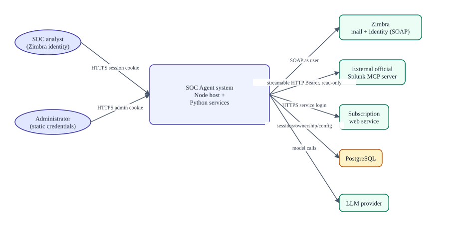
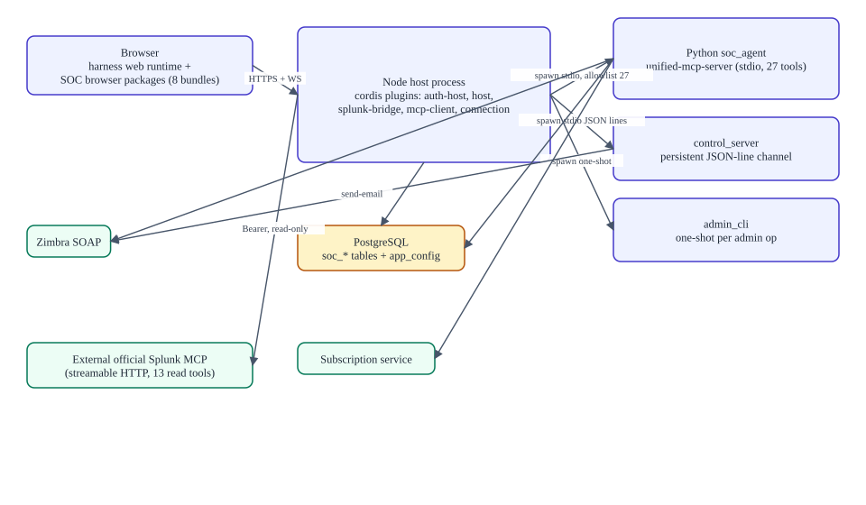
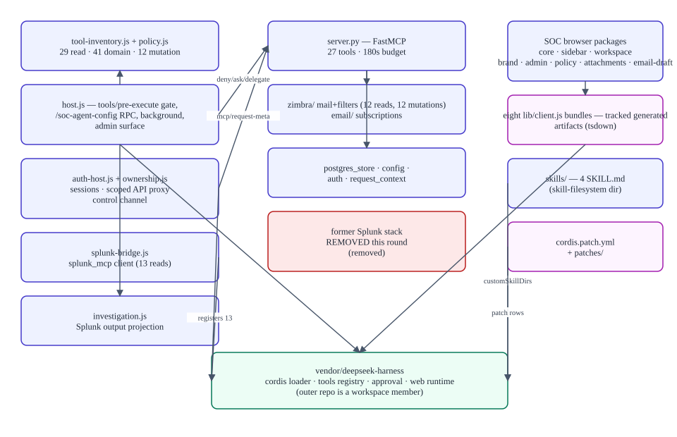
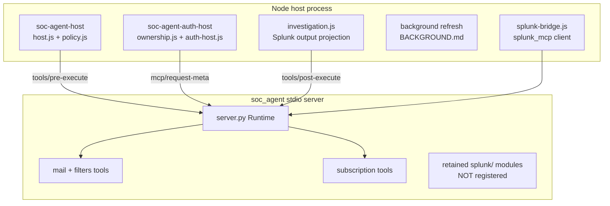

# Architecture

> **Verified against:** commit `56c8dd21492a5c36cb9f3eaa3da01160aba40033` (branch `splunk-offical-mcp`, committed 2026-09-12T07:22:44Z) · documentation verified 2026-09-12.
> 语言 / Language: **English** · [中文版](zh/ARCHITECTURE.md)

**Who this page is for:** developers and architects who need the real shape of the system — processes, boundaries, ownership, and extension points.

**What you will understand:** the system at four levels (context → containers → components → code map), where every process and trust boundary sits, how the pristine Harness and independent SOC workspace are composed, and what happens to data as it crosses each boundary.

**Plain-language summary.** One Node process serves the browser UI and hosts the SOC product plugins on the pristine rc.2 Harness. The browser side is split into a mandatory core, isolated sidebar/workspace packages, and six independently selectable feature packages; official sidebar/workspace plugins are disabled while their source remains frozen. The host spawns the Python MCP server as a stdio child (`soc_agent`), optionally connects out to an external official Splunk MCP server (`splunk_mcp`), talks SOAP to Zimbra through that Python child, HTTPS to a subscription service, and persists identity/ownership/config in PostgreSQL. Every tool call the model makes is filtered twice — by the harness registry and by the SOC host policy — and mutations need human approval.

**Prerequisites:** [PRODUCT_OVERVIEW.md](PRODUCT_OVERVIEW.md); vocabulary in [reference/GLOSSARY.md](reference/GLOSSARY.md).

---

## 1. System context

Editable source: [diagrams/system-context.mmd](diagrams/system-context.mmd).

| Actor / system | Relationship | Trust |
|---|---|---|
| SOC analyst | Browser → HTTPS (default port 3080), session cookie `soc_session` | Authenticated user |
| Administrator | Browser → `/admin`, cookie `soc_admin_session` | Admin (privileged API access) |
| SOC Agent system | The Node host + child processes described below | Trusted core |
| Zimbra | SOAP (`ZIMBRA_HOST`); identity = the logged-in user's session token | External, per-user credentials |
| External official Splunk MCP server | Streamable HTTP + Bearer token; **client is this repo** | External, service credentials; applies its own guardrails |
| Subscription service | HTTPS REST with form login | External, service credentials |
| PostgreSQL | `APP_POSTGRES_URI` (fallbacks `LANGGRAPH_POSTGRES_URI` → `POSTGRES_URI`) | Trusted store |
| LLM provider | Configured at runtime via the admin console (credentials write-only) | External |

## 2. Containers and process boundaries

Source: [diagrams/runtime-containers.mmd](diagrams/runtime-containers.mmd).

| Process | What it is | Started by | Talks to |
|---|---|---|---|
| **Node host** (single process) | Vendored harness web runtime + cordis plugins | `pnpm dsh web --no-open` | Browser (HTTP/WS), PostgreSQL (`pg` pool), Python children, external Splunk MCP |
| **`soc_agent` Python server** | FastMCP stdio server, 28 tools | `dsh-mcp-client` per `cordis.patch.yml` (`uv run unified-mcp-server`, `failOnStartupError: true`) | Zimbra SOAP, subscription REST, PostgreSQL |
| **Control server** (`unified_mcp_server.control_server`) | Persistent JSON-line channel for authenticated ops | `ownership.js startControlChannel` (or one-shot `auth_cli` when `SOC_CONTROL_CHANNEL=off`) | PostgreSQL, Zimbra (send) |
| **Admin CLI child** (`unified_mcp_server.admin_cli`) | One-shot per admin operation | `host.js runAdmin` → `python-command.js` | Subscription service (test), PostgreSQL (migrate) |
| **Browser** | Harness web runtime + 26 SOC browser faces (`lib/client.js` closure factories loaded via `window.__ModuleLoader__`): core, isolated sidebar/workspace, and six optional feature packages | — | Node host only |

Network boundaries: browser↔host (HTTP/WS, cookies), host↔Splunk MCP (outbound HTTPS), Python↔Zimbra/subscription (outbound), everything else is local IPC (stdio pipes) or loopback DB. Process boundary notes: the Python server never receives `SOC_ADMIN_*` env vars (stripped in `env_loader.py`, `childEnvironment()`, and `runAdmin`); the control channel is a private parent-child pipe whose authorization is the `session_id` in each payload.

**Why `soc_agent` and `splunk_mcp` must not be collapsed into one box:** `soc_agent` is a locally implemented server executing *as* the signed-in user; `splunk_mcp` is a client bridge executing *with service credentials* against an external endpoint. Their identity sources, failure modes (spawn failure vs connection failure), and guardrails (local policy vs remote server) are different.

## 3. Components

Source: [diagrams/component-map.mmd](diagrams/component-map.mmd). Full 11-field descriptions: [reference/COMPONENT_CATALOG.md](reference/COMPONENT_CATALOG.md).

Dependency highlights:

- **`tool-inventory.js` is the vocabulary**: a single runtime-independent module exports every tool name; `policy.js` derives its sets from it and the bridge imports its raw names. The Python registration count is pinned to the same inventory by tests (`policy.test.js`, `skills.test.js`, `splunk-bridge.test.js`, `test_server_tools.py`) — drift now fails imports or tests, not just review.
- **ownership.js is the biggest first-party module** (1,875 lines) because it is both auth service and the scoped API proxy that makes the harness's own APIs per-user safe.
- **The Harness is pristine and the SOC workspace is independent**: `tooling/verify-upstream.mjs` compares `vendor/deepseek-harness` with the immutable rc.2 release, while `cordis.patch.yml` disables mapped official rows and inserts SOC-owned replacements. The six optional client features are separate packages, including the contract-based `dsh-soc-agent-auto-collapse`; there is no vendor file patch.

## 4. Code map

| Layer | Canonical source | Generated | Tests |
|---|---|---|---|
| Node plugins | `apps/soc-agent/*.js` | — | `apps/soc-agent/tests/*.test.js` |
| Wiring | `apps/soc-agent/cordis.patch.yml`, `package.json` | — | `skills.test.js` (patch assertions) |
| Python server | `apps/soc-agent/server/unified_mcp_server/**` (active: `server.py`, `config.py`, `auth.py`, `request_context.py`, `schema.py`, `migrations/`, `postgres_store.py`, `errors/responses`, `blocking_io`, `env_loader`, `zimbra/**`, `email/`, `attachment_converter.py`, `control_server.py`, `admin_cli.py`, `auth_cli.py`) | — | `unified_mcp_server/tests/` (48 tests) |
| Schema | `unified_mcp_server/schema.py`, `migrations/*.sql` | — | `test_schema.py` (3) |
| Browser packages | `packages/soc-agent-*/src/**` | `packages/soc-agent-*/lib/*` (**tracked**) | package-local tests plus `apps/soc-agent/tests/browser-smoke.test.mjs` |
| Skills | `skills/*/SKILL.md` | — | `skills.test.js` content invariants |
| Vendor | `vendor/deepseek-harness/**` (pinned `dsh-v0.1.5-rc.2`; isolated and immutable) | harness build outputs (untracked) | `tooling/verify-upstream.mjs` |

Per-file index: [reference/SOURCE_INDEX.md](reference/SOURCE_INDEX.md).

## 5. Trust boundaries and gates (summary)

1. **Browser → host:** session cookies; same-site/origin checks on auth routes; private routes and WS upgrades fenced by `installTransport`; privileged APIs admin-only.
2. **Harness → tools:** registry-level restriction (`agent/created` best-effort) + authoritative `tools/pre-execute` exact-name allowlist.
3. **Host → MCP:** raw `allowedToolNames` per server; per-call metadata; 185 s timeouts.
4. **Python → identity:** `soc_session_id` → Postgres session → the user's own Zimbra token; `account_id` selection rejected; 180 s operation budget.
5. **Output → model:** Splunk projection (PII mask, 50 KB); tool-result pruner and compaction (upstream, thresholds in the preset); background 64 KiB cap.
6. **Mutation → human:** action states + approval waterfall; email additionally UI-confirmed.
7. **Patch-level:** model-facing shell/fs/subagent tool families disabled entirely.
8. **Configuration:** the official Splunk MCP connection is required — setup and `--check` fail without it, so a misconfigured deployment fails loudly instead of silently losing Splunk tools.

Full threat-oriented treatment: [SECURITY_AND_TRUST_BOUNDARIES.md](SECURITY_AND_TRUST_BOUNDARIES.md).

## 6. Data flow in one paragraph

Analyst input becomes a harness agent turn; the model may call an allowlisted tool; the host policy gate checks name + mode + per-tool state (asking the human when required); the call crosses the process boundary with session metadata; the Python server resolves the identity from Postgres, executes within the 180 s budget against Zimbra/subscription, and returns an `ok/error` envelope; for `splunk_mcp`, the external server's result is sanitized and truncated by the projection before entering model context; UI-visible results render through toolviews (the draft card being the special human-in-the-loop case); durable facts (settings, ownership, sessions) live in PostgreSQL; conversation/session artifacts live under the user's workspace and the harness state directories.

## 7. Extension points

- **Add a tool:** Python `register_tools` module + raw allowlist entry (`cordis.patch.yml`) + qualified-name policy entry (`policy.js`) + client labels if needed + tests on both tiers. Recipe: [DEVELOPMENT.md](DEVELOPMENT.md).
- **Add a skill:** a `skills/<name>/SKILL.md` — picked up by `skill-filesystem` on restart; no registration needed.
- **Change Harness behavior:** edit `cordis.patch.yml` rows (enable/disable/config) or the matching SOC replacement package — never edit vendor source. Verify the release snapshot with `pnpm run verify:upstream`.
- **Presets:** `apps/soc-agent/agent-presets/citic-soc/agent.cordis.yml` (persona, instruction candidates, compaction thresholds) — first-party configuration outside vendor, asserted by `skills.test.js`.

## Evidence in the repository

- Wiring: `apps/soc-agent/cordis.patch.yml` (authoritative plugin roster), `package.json` exports
- Processes: `vendor/deepseek-harness/packages/mcp/mcp-client/src/transport.ts` (spawn/HTTP), `apps/soc-agent/ownership.js startControlChannel`, `host.js runAdmin`
- Boundaries: `ownership.js installTransport/createScopedApiProxy`, `host.js tools/pre-execute`, `server.py fresh_runtime/execute`
- Diagrams: `docs/diagrams/*.mmd` (editable sources)

## Assumptions and unknowns

- Harness-internal behavior (reconnect backoff, compaction) is documented to the depth the integration needs; upstream internals are out of scope.
- Deployment topology beyond "single host + external services" (e.g. reverse proxies, clustering) is not configured in this repo and is unknown.
