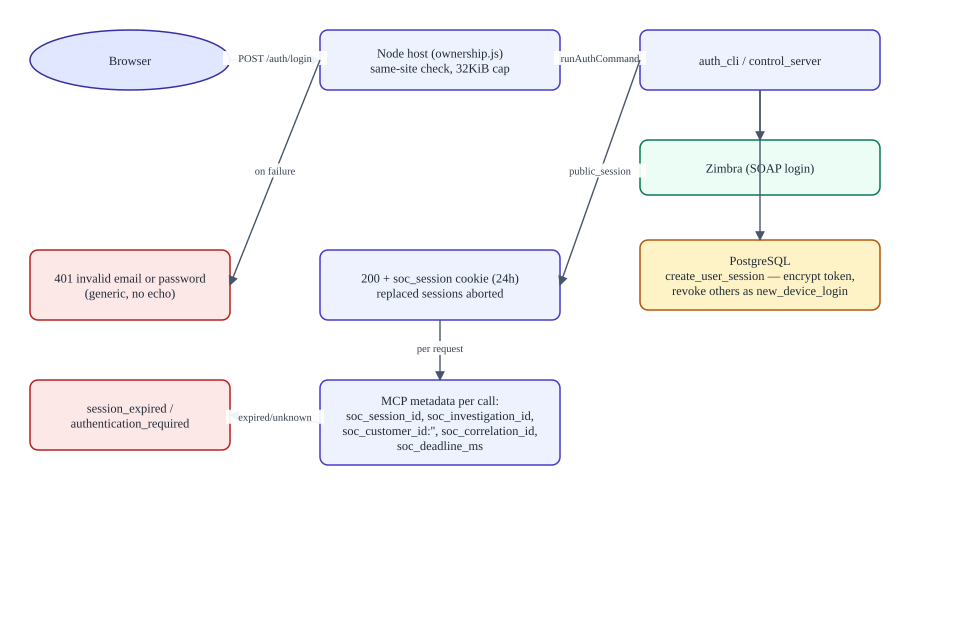

# Authentication and ownership

> **Verified against:** commit `56c8dd21492a5c36cb9f3eaa3da01160aba40033` (branch `splunk-offical-mcp`, committed 2026-09-12T07:22:44Z) · documentation verified 2026-09-12.
> 语言 / Language: **English** · [中文版](zh/AUTHENTICATION_AND_OWNERSHIP.md)

**Who this is for:** security reviewers and developers touching anything identity-related.

**What you will understand:** every authentication mechanism, how server-side identity is established and propagated, how per-user isolation is enforced (including the exact ownership checks), how the admin tier differs, credential handling and encryption, session lifecycle, and every denial path.

**Plain-language summary.** There are two principals: analysts (verified against Zimbra, 24 h Postgres-backed sessions, cookie `soc_session`) and the administrator (static env credentials, 8 h in-memory sessions, cookie `soc_admin_session`). The identity established at login — never anything in a prompt or tool result — is attached to every MCP call and every API request, and a scoped proxy makes the harness's own APIs per-user safe. Deny paths fail closed everywhere.

**Prerequisites:** [ARCHITECTURE.md](ARCHITECTURE.md) §2; flows in [RUNTIME_FLOWS.md](RUNTIME_FLOWS.md) §3–4.

---

## 1. Authentication mechanisms (verified)

| Mechanism | Principal | Verification | Store | Cookie |
|---|---|---|---|---|
| Analyst login `/auth/login` | Zimbra user | Credentials verified **by Zimbra** via Python (`auth_cli login` → `zimbra_login` SOAP); email normalized (`normalize_zimbra_email`) | `soc_app_sessions` (24 h; Zimbra token Fernet-encrypted) | `soc_session`: `HttpOnly; SameSite=Lax; Max-Age=86400; Path=/` + `Secure` when HTTPS is detected (`x-forwarded-proto` or encrypted socket) |
| Admin login `/admin/auth/login` | Static admin | `SOC_ADMIN_EMAIL` equality + `timingSafeEqual` password compare (length pre-check); **required at startup** — missing env throws | In-memory Map keyed by SHA-256(token); 8 h TTL; host restart logs admins out | `soc_admin_session`, same flags, `Max-Age=28800` |

Login hardening (both routes): same-site/origin check (`sec-fetch-site: cross-site` and `Origin`/`Host` mismatch → 403), POST-only (405), JSON-only (415), 32 KiB body cap (400). Failures collapse to fixed messages (`invalid email or password` / `authentication_failed`) — the submitted password is never echoed, and Python's generic `authentication_failed` prevents username enumeration.

**Single-device policy:** each new login revokes the user's other active sessions (`reason: "new_device_login"`), aborts their event streams, cancels their chat agents (including children via the parent-session closure), and clears per-session action modes. The displaced device learns why exactly once, from the one-shot `soc_session_revocations` row: "A new device logged in to this account. You have been signed out."

## 2. Server-side identity authority

The sequence above shows login, session creation, and every denial path in one picture (editable source: [diagrams/authentication-sequence.mmd](diagrams/authentication-sequence.mmd)).

The authenticated server-side user identity is authoritative. Concretely:

- Model prompts, retrieved emails, Splunk events, and tool results **cannot** select or change the application user. There is no user parameter on any MCP tool (`test_server_tools.py` asserts no `ctx`/`account_id` params).
- Every MCP call carries metadata injected by the host (`mcp/request-meta`): `soc_session_id` (the app session), `soc_investigation_id` (agent/session id), `soc_customer_id` (**always empty** — a placeholder, not a selector), `soc_correlation_id` (fresh UUID), `soc_deadline_ms` (now + 180 s).
- The Python server resolves `soc_session_id` → `identity_for_session(store, session_id)` → `ZimbraIdentity{user_id, zimbra_email, zimbra_token, session_id}`. Missing store → `authentication_required`; unknown/expired session → `session_expired`.
- Zimbra operations execute **as that identity**. Any attempt to pass a different `account_id` raises `account_selection_disabled` ("Zimbra uses the authenticated user's account."), and the runtime account store is a no-op (`EmptyAccountStore`) so persisted mailbox credentials can never be selected.

## 3. Request routing and privilege tiers

- `installTransport` fences the private surface: exact `/api` routes and everything under `/soc-agent-*` require a valid principal; WebSocket upgrades `/api/events.mux` and `/api/events.host` require a session.
- **Privileged API methods** (`PRIVILEGED_API_METHODS`: presets, host directory access, settings, credentials, LLM model discovery) require the **admin** principal. A user cookie on those paths → 403 `forbidden`; no cookie → 401.
- **Mixed methods** (`llm.providers`, `llm.models`) and `/soc-agent-config` RPCs accept either; the RPC endpoints then enforce `requireUser` / `requireAdmin` individually.
- Principals are bound per request via `AsyncLocalStorage` (separate stores for user and admin contexts).
- `connectionAuthorization.authorizePrivilegedRequest` gates the trusted-host connection channel itself (admin-only).

## 4. Ownership model (per-user isolation)

**Ownership claims** are first-class rows in Postgres — not derived from naming:

| Table | Claim | Write path |
|---|---|---|
| `soc_workspace_owners` | workspace id → user (+ path) | `claimWorkspace` (owner-guarded upsert) at login (`ensureGeneral`) or workspace create |
| `soc_session_owners` | session id → user + workspace | `claimSession` — insert only if the workspace is owned by the same user; `ON CONFLICT DO NOTHING`, then verified |
| `soc_folder_owners` | folder id → user | first-claim-wins |

**The scoped API proxy** (`createScopedApiProxy`) wraps nine harness API domains. For each call it: authorizes ids (deny on foreign ownership — e.g. 11 mutation methods tested: rename/delete session, fork, prompt, folder ops, goals, skills, presets); normalizes inputs (server-generated `session-<uuid>` ids; default General workspace; `folderId` must be owned); filters read results (workspace/session/folder lists; foreign snapshot ids dropped); and guards `respond` so approval/question answers can only resolve the caller's own pending requests (`{accepted:false, reason:'not-pending'}` otherwise).

**Workspace filesystem containment:** `workspace.create` accepts a single directory name only (rejects absolute paths, `.`, `..`, separators, NUL → `workspace-invalid-path`), resolves under `MCP_SERVER_ROOT/.data/soc-workspaces/<userId>/`, then `mkdir` + `realpath` canonicalization + `isWithinPath` containment (blocks traversal and symlink escape). The "General" workspace is protected from rename/delete (`workspace-protected`).

**Session ownership** requires *both* the `soc_session_owners` row and its parent `soc_workspace_owners` row to belong to the user (`sessionBelongsToUser`).

## 5. Event-stream scoping and redaction

Live frames (`/api/events.mux`, `/api/events.host`) are filtered per consumer: frames referencing foreign sessions/workspaces are dropped or id-filtered; `credentials/reference-updated` remote events are rewritten to the argument-free `llm/adapters-updated` (users never learn credential reference names); all other unprojected `host/remote-event`s are dropped; `stream/error` frames become a generic "event stream unavailable". If a consumer's application session stops belonging to them, the stream terminates. `events.mux` `since` cursors are filtered to owned sessions before dispatch. Approval and question requests register the caller as the only permissible answerer.

## 6. Credential handling and encryption

| Secret | Where | Protection |
|---|---|---|
| Zimbra session token | `soc_app_sessions.zimbra_token_encrypted` | Fernet (`APP_SETTINGS_ENCRYPTION_KEY`; valid keys used verbatim, others SHA-256-derived). Node reads deliberately omit the column; `public_session` never serializes it |
| Admin password | `SOC_ADMIN_PASSWORD` env | Required at startup; timing-safe compare; in-memory SHA-256 of session tokens; **stripped from every child process env** (Node `childEnvironment`, `runAdmin`; Python `env_loader._NODE_ONLY_ENV_NAMES`) |
| Settings (`app_config`) | Postgres | Fernet-encrypted per value; key mismatch raises with explicit remediation |
| Provider API keys | credentials API | Write-only: `credentials.set`; `describe` returns only `configured`/`writable`; UI shows "Stored securely · enter a new key to replace it" |
| Service secrets (Splunk token, subscription password, MarkItDown key) | `.env` files (chmod 600) | Redacted from `public_status` (`redact_endpoint`); remote error bodies withheld by the subscription client |
| SQLi surface on session ids | — | Session ids validated against `^[A-Za-z0-9_-]+$` (≤128 chars) before any query |

## 7. Session lifecycle and denial cases

- **Expiry:** enforced server-side; expired rows are deleted lazily on read; `/auth/me` reports `expires_at`; the browser polls every 30 s and on focus/visibility to catch expiry.
- **Logout:** DB session deleted, agent sessions unbound/aborted, cookie cleared (`Max-Age=0`).
- **Host restart:** analyst sessions survive (Postgres); admin sessions and session action-mode overrides do not (in-memory). In-memory revocation state can be lost on restart, which is why the `soc_session_revocations` table exists.
- **Denial cases (fail closed):** unauthenticated `/soc-agent-config` → `authentication-required`; user on admin endpoint → `admin-authentication-required` (403); missing Postgres → `authentication_required` from Python (login effectively impossible); expired/unknown session → `session_expired`; upstream token death → `zimbra_auth_error` deletes the app session; cross-site requests → 403.

## 8. What is enforced in the UI vs on the server

| Control | UI | Server |
|---|---|---|
| Login gate (Sentinel overlay) | Covers the shell | Routes + transport fencing enforce regardless |
| Action-mode switch | Convenience | `set-action-mode` validated server-side; per-session map; policy gate enforces |
| Per-tool ask/auto/disabled | Admin checklist UI | Enforced by `tools/pre-execute` from encrypted settings |
| Email Send confirmation | **UI-level** (`window.confirm`) | Server enforces authentication, session identity, `ZIMBRA_ALLOW_SEND` gate, and Zimbra's `sent:true` before reporting success — but there is no separate server-side confirmation token (see [TRACEABILITY_MATRIX](reference/TRACEABILITY_MATRIX.md) #32) |
| Write-only credentials | Password inputs | `credentials.describe` returns booleans only |

## Evidence in the repository

- `apps/soc-agent/ownership.js` (auth service, scoped proxy, control channel), `auth-host.js` (wiring, metadata)
- `apps/soc-agent/server/unified_mcp_server/auth.py`, `postgres_store.py`, `auth_cli.py`
- Tests: `auth.test.js` (10), `user-mode.test.js`, `test_auth.py` (4), plus client `action-policy.test.ts`
- Sequence diagram: [diagrams/authentication-sequence.mmd](diagrams/authentication-sequence.mmd)

## Unknowns

- Behavior behind a reverse proxy (cookie `Secure` detection relies on `x-forwarded-proto`) depends on deployment topology, which is not configured in this repo.
- Zimbra's own session/token lifetimes are external and may end a session earlier than 24 h (handled as `zimbra_auth_error` → re-login).
