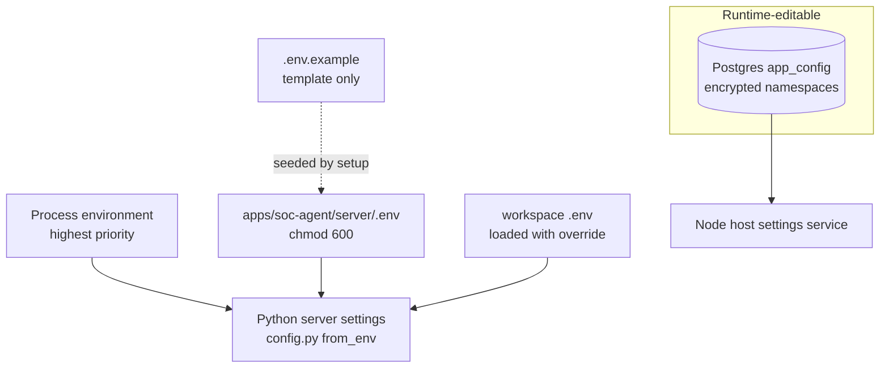

# Configuration

> **Verified against:** commit `b26d55d274cf298a456d84edfbcb42b8dc90134b` (branch `splunk-offical-mcp`, committed 2026-09-11T15:35:35Z) · documentation verified 2026-09-12.

**Who this is for:** operators deploying or reconfiguring the system, and developers tracing where a value comes from.

**What you will understand:** configuration sources and their exact precedence, which settings are required vs optional, how secrets are provisioned safely, how encrypted values work, per-service configuration, default behavior, and what a configuration change requires (restart vs rebuild). The variable-by-variable reference lives in [reference/CONFIGURATION_REFERENCE.md](reference/CONFIGURATION_REFERENCE.md); this page is the map.

**Plain-language summary.** Everything is deployment-owned: the Python server reads only environment variables (seeded into `apps/soc-agent/server/.env` by the setup doctor), the Node host reads its own env plus that same file, and the admin console can change only the small set of runtime settings stored (encrypted) in PostgreSQL. Nothing is configurable from the browser that would weaken security.

**Prerequisites:** [GETTING_STARTED.md](GETTING_STARTED.md) §3.

---

## 1. Sources and precedence

Source: [diagrams/configuration-precedence.mmd](diagrams/configuration-precedence.mmd).

- **Python:** env-only by design ("never from the database or a browser-editable document", `config.py`); `env_loader.load_server_env` reads `server/.env` then workspace `.env` **with override**; process environment still wins for keys set before load.
- **Node bridge:** `splunk-bridge.js` reads `process.env` first, then `server/.env`.
- **Node auth:** `resolveApplicationStorageUri` / `resolveAdminCredentials` follow the same env → `server/.env` order.
- **Admin-editable runtime settings** (encrypted `app_config`): `soc-action-approval`, `soc-background`, `soc-agent-markitdown-attachments`, `time-context`, `llm-pi-ai` + credential refs. These never include service endpoints — the console says so ("Service configuration is managed by the server environment.").
- **Env-var fallback chains as coded:** storage `APP_POSTGRES_URI` → `LANGGRAPH_POSTGRES_URI` → `POSTGRES_URI`; server root `DSH_SOC_AGENT_SERVER` → `<bundle>/server`; workspace root `MCP_SERVER_ROOT` → legacy `MCP_SEVER_ROOT`; Splunk retained aliases (`SPL_*` → `SPLUNK_*`); Docker: `RUNNING_INSIDE_DOCKER=1` selects `SPLUNK_HOST_FOR_DOCKER`.

## 2. Required vs optional

| Condition | Required |
|---|---|
| Any deployment | `SOC_ADMIN_EMAIL`, `SOC_ADMIN_PASSWORD` (host refuses to start otherwise) |
| Login/ownership | `APP_POSTGRES_URI` (one of the chain) + `APP_SETTINGS_ENCRYPTION_KEY` |
| Zimbra features | `ZIMBRA_HOST` (`configured = bool(host)`) |
| Splunk bridge | `SPLUNK_MCP_ENDPOINT` **and** `SPLUNK_TOKEN` — both or the bridge stays off |
| Subscription tools | `SUBSCRIPTION_SERVER_URL` + `SUBSCRIPTION_SERVER_USER` + `SUBSCRIPTION_SERVER_PASSWORD` |
| LLM conversion (MarkItDown OCR/LLM) | `MARKITDOWN_LLM_ENABLED=true` ⇒ `MARKITDOWN_LLM_API_KEY` + `MARKITDOWN_LLM_MODEL` |
| Everything else | Optional with safe defaults (timeouts, limits, TLS verification on) |

## 3. Safe secret provisioning

- Secrets go **only** into the chmod-600 `.env` files, entered through setup prompts (`read -rs`, never echoed) or direct file edits. Never in shell commands (history), tickets, chats, or this documentation.
- The setup doctor auto-generates `APP_SETTINGS_ENCRYPTION_KEY` (openssl, `/dev/urandom` fallback) if left blank.
- `SOC_ADMIN_EMAIL`/`SOC_ADMIN_PASSWORD` are **Node-only**: stripped from Python child environments in three places (`env_loader`, `childEnvironment`, `runAdmin`). They exist to protect the admin console, not to be reused elsewhere.
- The encryption key and the database must be backed up **together** (see [DATA_AND_PERSISTENCE.md](DATA_AND_PERSISTENCE.md) §6).
- Validation is fail-closed and non-echoing: endpoints reject userinfo/query/fragment/plain-HTTP unless the matching `*_ALLOW_INSECURE_HTTP` is set; credential-bearing Splunk/Zimbra endpoint shapes are rejected (`test_config.py`); status output redacts (`redact_endpoint`).

## 4. Encrypted values

`app_config` and stored tokens use Fernet. A valid Fernet key is used verbatim; anything else is SHA-256-derived into a key (documented in code). Consequences: rotating the key makes existing encrypted rows undecryptable (explicit runtime error with remediation, not silent corruption); provider keys use the write-only credentials API on top of the same storage.

## 5. Per-service configuration notes

| Service | Key facts |
|---|---|
| Splunk (bridge) | Three variables only; `SPLUNK_VERIFY_SSL` default true; timeout 185 s fixed in the bridge |
| Splunk (retained config) | Fully parsed/validated (`SPLUNK_*` families incl. query policy, resource governance, lookups, security queue) but no runtime service; consumed by `public_status` hashing and admin `test-splunk` |
| Zimbra | Host + TLS + timeout + seven mutation gates (`ZIMBRA_ALLOW_*`) + attachment limits; legacy `ZIMBRA_EMAIL/PASSWORD` and account-file keys are compat-only |
| Subscription | URL/user/password/timeout/allow-insecure-http; redirect policy hard-coded (≤5, same host, no downgrades) |
| MarkItDown | Optional LLM/OCR via key+model; built-in conversion always available |
| Harness | `vendor/deepseek-harness/.env` receives only the Postgres URI + encryption key from setup |

## 6. Restart / rebuild implications

| Change | Requires |
|---|---|
| `.env` value (either file) | Host restart (env read at startup); Python children restart with the host |
| Admin-console settings (`app_config`) | Nothing — live-applied (`applies: 'live'` schema), session action-mode overrides take effect immediately |
| Client source change | `pnpm --filter dsh-soc-agent-client run build` (tracked `lib/`) + browser reload |
| Skill file change | New session (skills are loaded per session) — verify at next session start |
| `cordis.patch.yml` change | Host restart; run `./setup.sh --plugins` if profile wiring is affected |
| Harness/vendor change | `./setup.sh --plugins` (fingerprint-gated rebuild) or `--rebuild` |

## Evidence in the repository

- `unified_mcp_server/config.py` (`from_env`, env-only comment, validation, `public_status` redaction), `env_loader.py`
- `apps/soc-agent/splunk-bridge.js` (`resolveOfficialSplunkConfig`), `ownership.js` (`resolveAdminCredentials`, `resolveApplicationStorageUri`), `setup.sh` (`collect_parameters` precedence chain)
- `apps/soc-agent/server/.env.example` (the full safe template)

## Unknowns

- Which retained `SPLUNK_POLICY_*`/`SPLUNK_SEARCH_*` values a future re-registration would need re-tuning — they are validated but not exercised at runtime today.
- Reverse-proxy header handling (`x-forwarded-proto`) is deployment-specific.
