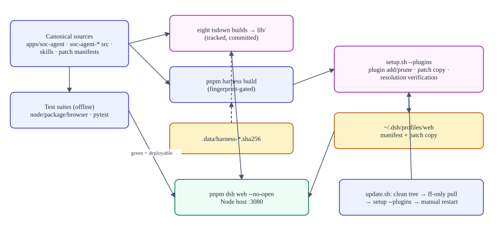

# Deployment and operations

> **Verified against:** commit `b26d55d274cf298a456d84edfbcb42b8dc90134b` (branch `splunk-offical-mcp`, committed 2026-09-11T15:35:35Z) · documentation verified 2026-09-12.

**Who this is for:** operators deploying, updating, monitoring, and recovering the system.

**What you will understand:** the supported topology, the setup doctor's responsibilities stage by stage, the build/wiring lifecycle, startup and health checks, the update flow with its clean-tree rule, rollback/recovery options that actually exist in the source, logging/observability, and the operational safety checks worth running periodically.

**Plain-language summary.** One host on one machine, three external services, one database. `setup.sh` installs and repairs everything reproducibly (fingerprints, byte-compared patches, pruned plugin set); `update.sh` is a disciplined fast-forward; restart is manual and state survives it by design (Postgres sessions do; admin sessions don't).

**Prerequisites:** [GETTING_STARTED.md](GETTING_STARTED.md); [CONFIGURATION.md](CONFIGURATION.md).

---

## 1. Supported topology

Single Node host process (vendored harness web runtime) on port 3080, spawning: the Python MCP server (stdio child), the persistent control channel (stdio child), and one-shot admin CLI children. Outbound: Zimbra (SOAP), external official Splunk MCP (streamable HTTP), subscription service (HTTPS), LLM provider, PostgreSQL. Remote users typically connect via SSH tunnel (`ssh -L 3080:127.0.0.1:3080`) per the root README; reverse-proxy topologies are not configured in this repo (see unknowns).

## 2. The setup doctor, stage by stage

| Stage (`setup.sh`) | Responsibility | Repairs |
|---|---|---|
| Layout guard | Requires `vendor/deepseek-harness`, `apps/soc-agent/server/`, `server/.env.example`, `requirements.txt`, the patch file | none — refuses |
| Prerequisites | Node `^22.19.0\|>=24`, pnpm, uv (PATH fix for pnpm) | Loops with install hints; `skip` records a warning |
| Parameter collection | Merges defaults with precedence `.env.example` < harness `.env` < server `.env` < environment; prompts all services; validates Postgres URI (regex + `psql` probe); generates the encryption key if blank | Re-prompts only invalid/missing; existing values become defaults |
| `write_files` | Seeds/upserts `server/.env` (preserves comments; optional keys only when supplied) and harness `.env` (only the two keys); chmod 600; ensures `.gitignore` covers `.env` | Warns when an exported env var differs from the written value (export wins) |
| `ensure_python_server` | `uv sync --python 3.12` (+ `--extra markitdown-llm` when enabled) | Failure records a warning and continues |
| `ensure_harness_ready` | Fingerprint-gated `pnpm install --frozen-lockfile` + build (fingerprints: lockfile+package manifests → install; all harness+client sources → build); verifies artifacts (`apps/web/dist/index.html`, `mcp-client/lib/index.js`) | `--rebuild` bypasses fingerprints; SOC client bundle drift (`require` allowlist) triggers client rebuild |
| `ensure_external_plugins` | Copies the pnpm patch to the profile (byte-compared), edits `pnpm-workspace.yaml` `patchedDependencies`, installs the two `requirements.txt` specs via `pnpm dsh plugin --profile web add`, **prunes stale plugins** outside the managed set, re-verifies deps+bundles | Re-running is the repair; deleting a line in `requirements.txt` propagates removal everywhere on the next run |
| `ensure_soc_bundle` | Registers `apps/soc-agent` + `packages/soc-agent-client` into the web profile; verifies resolution of `dsh-soc-agent/auth-host`, `dsh-soc-agent/host`, `dsh-soc-agent-client`, `@deepseek-ai/dsh-time-context`, and the external plugins | Re-runnable |
| Summary | Prints masked values, files written, warnings, next steps | Starts **nothing** |

`--check` runs the read-only audit (prerequisites, every parameter with precedence, Docker-aware Splunk host, HTTP-policy checks, plugin parse, profile patch/registration, stale plugins, build artifacts, SOC drift, resolution) and exits 1 with a failure count.

## 3. Build/wiring lifecycle

 — source: [diagrams/build-test-deploy.mmd](diagrams/build-test-deploy.mmd).

Canonical sources → (client: tsdown → **tracked** `lib/`; harness: pnpm build → untracked dists) → profile wiring (`~/.dsh/profiles/web`: manifest bundles, patch copy) → runtime (Node host loads profile; spawns Python children). The fingerprints make the lifecycle reproducible: identical inputs skip identical work.

## 4. Startup, restart, health

- **Start:** `cd vendor/deepseek-harness && pnpm dsh web --no-open` → open `http://127.0.0.1:3080`.
- **Health checks available:**
  - `./setup.sh --check` — full static audit (run anytime).
  - Admin console → Connections → *Check* on Splunk / Subscription server (live connectivity via admin CLI; Zimbra/MarkItDown show environment-managed status only).
  - Browser `/auth/me` (session probe) and admin `/admin/auth/me`.
  - Startup log lines: bridge enabled/disabled, plugin registration, Python spawn (`failOnStartupError` makes a dead Python fatal at boot).
- **Restart:** stop the process and start again. Sessions, ownership, settings survive (Postgres). Admin sessions, session action-mode overrides, and in-memory caches do not — by design.
- **Generated environment files:** `server/.env`, `vendor/deepseek-harness/.env` (both 0600), `.data/harness-*.sha256`; profile files under `~/.dsh/profiles/web/`.

## 5. Update flow

`./update.sh`: refuses arguments → requires a Git checkout with `setup.sh` at root → **refuses a dirty working tree** (`git status --porcelain --untracked-files=all`; untracked files count; never stashes or discards) → `git pull --ff-only` on the current branch (no branch switching) → `bash setup.sh --plugins` → "restart the web app manually if it is running." Branch changes go through `./setup.sh` instead (also clean-tree only).

## 6. Rollback / recovery options found in source

| Situation | Options that exist |
|---|---|
| Bad update | `git reset`/`git checkout` to the previous commit **manually** (update.sh never manipulates history), then `./setup.sh --plugins`; restart |
| Broken profile wiring | `./setup.sh --plugins` re-adds/prunes/re-verifies the managed plugin set; `--rebuild` forces full harness rebuild |
| Drifted client bundle | Setup detects and rebuilds it automatically (require-allowlist check) |
| Failed Python env | `uv sync --python 3.12` in `apps/soc-agent/server`; rerun setup |
| Bad `.env` edit | Re-run `./setup.sh` (existing values become defaults; only invalid items re-prompt) — or restore from your backup of the 0600 file |
| Encrypted rows unreadable after key rotation | Restore the previous `APP_SETTINGS_ENCRYPTION_KEY` (the runtime refuses to silently continue; error names the remediation) |
| Session cleanup | Sessions expire in 24 h; `zimbra_auth_error` self-heals by deleting the app session; revocations are one-shot and expiry-bounded |

There is **no built-in database backup/restore command** — use your PostgreSQL tooling; back up the encryption key with the data.

## 7. Logging and observability

- Python server: `LOG_LEVEL` (default INFO); per-call logs `mcp_call ok/failed` with prepare/total timings and a 12-hex correlation id (`execute()`); unexpected exceptions are logged **without** third-party text.
- Node host: harness logging; background refresh warnings (`soc-background: … read failed`); bridge lifecycle info ("official Splunk MCP bridge disabled: …").
- Admin command failures: stderr JSON parsed and surfaced through the RPC (message ≤400 chars, up to 20 `missing_environment_variables`).
- Correlation: `soc_correlation_id` per MCP call (fresh UUID), `soc_investigation_id` per agent session — use them to join logs across Node/Python.
- No metrics/OTel: `session-telemetry-otel` is explicitly disabled in the patch.

## 8. Operational safety checks (recommended cadence)

1. `./setup.sh --check` after every update and periodically.
2. Run the three test suites before deploying a changed checkout ([TESTING.md](TESTING.md)) — especially the namespace fence.
3. Verify the bridge posture: with Splunk unconfigured, confirm the log says disabled (fail-safe absence of tools).
4. Confirm admin credential env vars are set at boot (startup throws otherwise — treat that as the control working).
5. Review `~/.dsh/profiles/web` for unmanaged plugins after any manual `pnpm dsh plugin` use.
6. Backup: PostgreSQL + `APP_SETTINGS_ENCRYPTION_KEY` + the two `.env` files ([DATA_AND_PERSISTENCE.md](DATA_AND_PERSISTENCE.md)).

## Evidence in the repository

- `setup.sh` (all stages, `--check` checks, header comments on fingerprints/pruning), `update.sh`, root `README.md` (run/tunnel/update), `host.js` (health endpoints via RPC, admin page serving), `admin_cli.py` (test commands), `cordis.patch.yml` (telemetry disabled, `failOnStartupError`).

## Unknowns

- Production process supervision (systemd/containers) is not configured in this repo; `RUNNING_INSIDE_DOCKER`/`SPLUNK_HOST_FOR_DOCKER` suggest a container deployment exists elsewhere — its definition is not in this checkout.
- Log aggregation and alerting are deployment concerns outside the repository.
