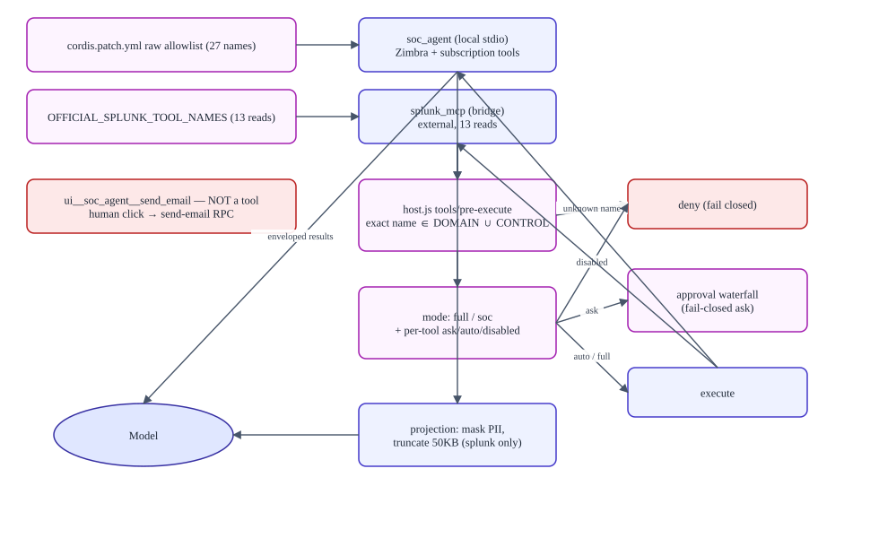

# MCP and tool routing

> **Verified against:** commit `b26d55d274cf298a456d84edfbcb42b8dc90134b` (branch `splunk-offical-mcp`, committed 2026-09-11T15:35:35Z) · documentation verified 2026-09-12.

**Who this is for:** anyone who has ever been confused by a tool name here — which, given the naming, is everyone eventually.

**What you will understand:** what MCP does in this repository, how a tool name is built and checked at each layer, why `soc_agent` and `splunk_mcp` are separate servers, why a name can repeat a product word, which names are *not* tools, and how tests prevent the inventories from drifting apart.

**Plain-language summary.** The model can only call tools that survive three filters: a raw allowlist per MCP server (in the patch), the agent's restricted tool set, and an exact-name policy gate in the host. Read tools run automatically; the 12 mutation actions ask for approval; email delivery is not a tool at all. Splunk tools come from an external server through a client bridge; Zimbra/subscription tools come from a local Python server that acts as the signed-in user.

**Prerequisites:** [ARCHITECTURE.md](ARCHITECTURE.md) §2. Complete tool tables: [reference/MCP_TOOL_CATALOG.md](reference/MCP_TOOL_CATALOG.md).

---

## 1. MCP's role, in plain language

MCP (Model Context Protocol) is how the harness gives the AI model tools. A *server* exposes *tools*; the harness's MCP *client* connects to servers and registers their tools on the model's tool list. This repository has exactly two connections, and they are asymmetric:

| | `soc_agent` | `splunk_mcp` |
|---|---|---|
| What it is | Local Python MCP **server** (FastMCP), spawned as a stdio child | A **client bridge** (`splunk-bridge.js`) to an external official Splunk MCP server |
| Where the code lives | `apps/soc-agent/server/unified_mcp_server/` | `apps/soc-agent/splunk-bridge.js` (client side only) |
| Transport | stdio (`uv run unified-mcp-server`) | streamable HTTP + `Authorization: Bearer` |
| Tools | 28 (Zimbra mail/filters + subscriptions) | 13 read tools |
| Identity | The signed-in user (Postgres session → their Zimbra token) | Service token from env |
| Failure mode | Spawn failure is fatal (`failOnStartupError: true`) | Disabled silently when endpoint/token missing; connection errors surface per call |
| Guardrails | Local envelope + validation; upstream Zimbra | **Remote** server-side guardrails; local projection afterwards |

## 2. Naming anatomy

**Fully qualified name** = `mcp__<server-name>__<raw-tool-name>`.

```
mcp__ splunk_mcp __ splunk_run_query
└host┘ └─server─┘  └────raw tool────┘
```

- The `mcp__` prefix is added by the harness client when registering server tools.
- `splunk_run_query` is the raw name the external server exposes; `splunk_mcp` is the namespace the bridge declares (`serverName: 'splunk_mcp'`). The word `splunk` appearing twice means *one* product word used in *two* different layers — not two servers.
- **Three identifier layers** (frequently confused): the cordis *plugin id* (`splunk-official-mcp`), the *plugin package* (`dsh-soc-agent/splunk-bridge`), and the *MCP server namespace* (`splunk_mcp`). Same triple for the Python server: `soc-agent-mcp` → `@deepseek-ai/dsh-mcp-client` (instance) → `soc_agent`.

### Name shapes that are NOT MCP tools

| Shape | Example | What it is |
|---|---|---|
| `ui__<server>__<action>` | `ui__soc_agent__send_email` | A UI-confirmed entry in `TOOL_CATALOG` (admin checklist). It is a *label* for the human send path; the model can never call it |
| Unprefixed host tool | `skill` | The harness skill-loading tool, in `READ_ONLY_TOOLS`; part of `DOMAIN_TOOLS` |
| Harness interaction tools | `ask_user_question`, `exit_plan_mode` | Allowed by `host.js CONTROL_TOOLS` alongside `DOMAIN_TOOLS` |

### Name-vs-behavior traps (memorize these)

1. **`zimbra_send_email` does not send.** It builds a local draft (docstring: "Build a local draft without contacting or writing to Zimbra"), is classified *read-only*, and is labeled "Create email draft" in the UI. Actual delivery = draft view → `window.confirm` → `send-email` host RPC → control channel → `ZimbraMailService.send_email` (gated by `ZIMBRA_ALLOW_SEND`). No model-callable tool sends email.
2. **`zimbra_use_signature_on_email` also does not send** — it produces an editable draft with the signature merged.
   **`zimbra_forward_email` creates a local forward draft** after reading one source message. Its body is the analyst's note; the original content and attachments are added by the existing `zimbra-client` package only after explicit UI Send through the same private `send-email` command.
3. **`preview_subscription` and `validate_email_filter` are read tools** that compute proposed changes without writing.
4. **Retained tool names in skills.** `detection-engineering`/`spl-writing` reference `splunk_get_detection`, `splunk_compile_citic_detection`, `splunk_backtest_detection`, `splunk_validate_detection` — those exist only in the retained (unregistered) Python implementation at this commit. See [DOCUMENTATION_AUDIT.md](DOCUMENTATION_AUDIT.md).

## 3. Routing layers (who checks what)



Source: [diagrams/mcp-routing.mmd](diagrams/mcp-routing.mmd).

1. **Registration (raw allowlists).** `cordis.patch.yml` gives each server `allowedToolNames`: the exact 28 for `soc_agent` and the bridge exposes exactly `OFFICIAL_SPLUNK_TOOL_NAMES` (13). `dsh-mcp-client` registers nothing outside them (`allowedToolNames` filtering, `mcp-discovery.test.js`).
2. **Restriction (agent tool set).** On `agent/created`, `host.js` calls `tools.restrict({allow: [...DOMAIN_TOOLS, ...CONTROL_TOOLS]})` — best-effort, because MCP tools may still be registering.
3. **Enforcement (authoritative gate).** `tools/pre-execute` (global): exact string membership in `DOMAIN_TOOLS ∪ CONTROL_TOOLS` or deny ("This harness exposes only approved Splunk, Zimbra, and subscription tools."). Then mode/state: `full` → delegate everything; `soc` → per-tool `ask|auto|disabled` (defaults: mutations `ask`, reads `auto`). `ask` verdicts enter the harness approval waterfall (fail-closed — no answer, no run).
4. **Identity metadata.** For both server names, `mcp/request-meta` attaches `soc_session_id`, `soc_investigation_id`, `soc_customer_id: ''`, `soc_correlation_id`, `soc_deadline_ms` (now + 180 s). The empty customer id is intentionally *not* a selector — identity is server-side only.
5. **Output boundary.** `tools/post-execute` (projection) for `mcp__splunk_mcp__splunk_*`; envelope shaping for everything from `soc_agent`.

## 4. Read-only vs mutation classification

- **Read-only (`READ_ONLY_TOOLS`, 30):** `skill` + 13 Splunk reads + 9 Zimbra mail reads/draft builders + 4 filter reads/validators + 3 subscription reads. `zimbra_send_email` and `zimbra_forward_email` are read-classified because they create local drafts and never deliver mail.
- **Mutations (`ACTION_CATALOG`, 12):** Zimbra `move_email`, folder create, signature create/delete, the five filter writes, and the three subscription writes. All default to `ask`; all additionally gated Python-side by env flags (`ZIMBRA_ALLOW_*`) and, for filters, by `expected_fingerprint` optimistic concurrency.
- **`APPROVAL_TOOLS` = `ACTION_TOOLS`** and `ALWAYS_ASK_ACTION_TOOLS` is empty — the per-tool state map (admin "Access & approvals") is the single place defaults are overridden.
- **UI-confirmed:** `ui__soc_agent__send_email` renders with an "Explicit confirmation" badge and cannot be automated.

## 5. Output projection and presentation

- Splunk results are projected (mask card/SSN; truncate 50 KB with a visible marker) before entering model context — [RUNTIME_FLOWS.md](RUNTIME_FLOWS.md) flow 14.
- Draft tool results are rendered by `EmailDraftToolview` (keyed on both draft tool names) rather than shown as raw JSON.
- Everything else renders as harness tool views.

## 6. How tests prevent namespace and inventory regressions

| Drift risk | Guard |
|---|---|
| Python server registers something outside the 27 | `test_server_exposes_exact_domain_tool_set` (exact set; also forbids `ctx`/`account_id` params) |
| Patch allowlist ≠ Python surface | `skills.test.js` pins the patch's 27-name list; JS and Python pin the **same** list independently |
| Bridge allowlist gains a write tool | `splunk-bridge.test.js` + `skills.test.js` assert no `splunk_(create|update|delete|write)_` and exact read names |
| Policy sets drift from the catalog | `policy.test.js` pins 29/41/12 and derives `ACTION_TOOLS` from `ACTION_CATALOG` (single source of truth by construction) |
| Client invents a mode or bypasses the endpoint | `action-policy.test.ts` (exact RPC triple; fail closed) |
| Vendored client changes allowlist semantics | `mcp-discovery.test.js` round-trips `allowedToolNames` |

**Changing a tool safely:** the synchronized-update recipe is in [DEVELOPMENT.md](DEVELOPMENT.md) §"Adding or changing a tool".

## Evidence in the repository

- `apps/soc-agent/cordis.patch.yml` (`soc-agent-mcp.allowedToolNames`, bridge insert), `apps/soc-agent/splunk-bridge.js` (`OFFICIAL_SPLUNK_TOOL_NAMES`), `apps/soc-agent/policy.js` (all sets), `apps/soc-agent/host.js` (`tools/pre-execute`, `CONTROL_TOOLS`)
- `apps/soc-agent/server/unified_mcp_server/server.py` (registration call sites), `zimbra/mail/tools.py`, `zimbra/filters/tools.py`, `email/tools.py`
- Tests: `policy.test.js`, `skills.test.js`, `splunk-bridge.test.js`, `mcp-discovery.test.js`, `test_server_tools.py`, `test_official_splunk_mcp_client.py`

## Assumptions and unknowns

- The external official Splunk MCP server's own tool set beyond the 13 allowlisted names is unknown here (the bridge filters registration, so extras would not register).
- Line-level behavior of the harness approval waterfall is upstream code summarized from its documented policy (`fail-closed`), not re-verified line by line.
