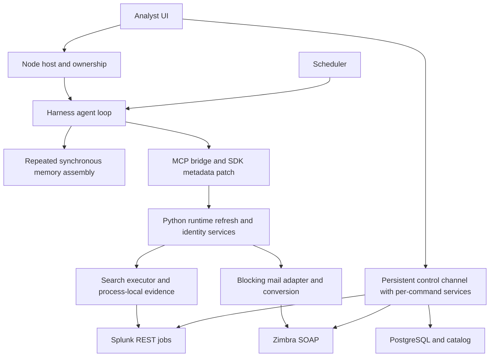
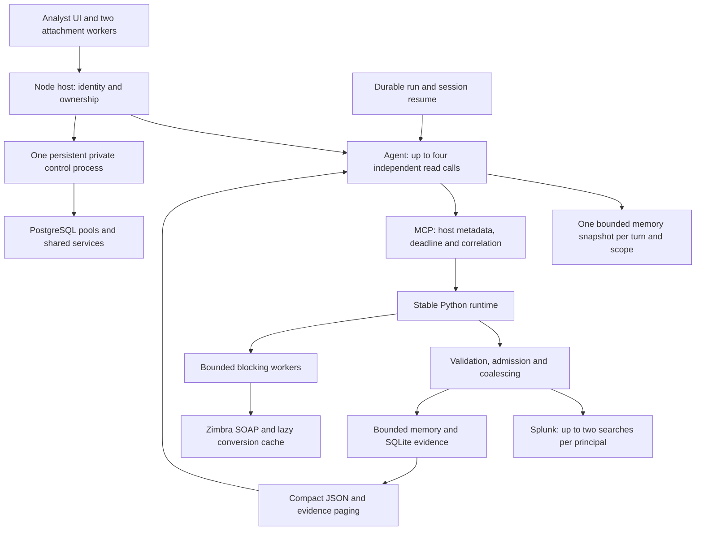

# SOC performance redesign: implementation and verification

Date: 2026-09-05. Base: merged commit `6d9eb4c`. This implementation extends the
existing performance foundations and fixes integration defects found during
verification. No deployment, live investigation, email send or Splunk write was
performed. Changes remain uncommitted.

**1. Architecture at the merge baseline**



The baseline already included a search evidence coordinator, a persistent control
protocol and concurrency support. The changes below make those paths compose
correctly and retain useful work across retries and restarts. The original code
is available with `git show 6d9eb4c:<path>`.

**2. Bottlenecks ranked by expected operational impact**

| Rank | Evidence in the repository | Implementation / remaining limit |
|---|---|---|
| 1 | `server.py` refreshed shared services, constructed `CatalogService` with the wrong arguments, and awaited synchronous catalog callbacks. | Stable runtime, correct factory, immutable identity views and bounded background database work. These defects could prevent investigations from running. |
| 2 | `splunk/search/evidence.py` retained results only in memory and tied shared work to its first caller. | Scoped SQLite retention, independent reader cancellation, last-reader cleanup and explicit fresh reads. Reduces provider work; repeated MCP invocations themselves still exist. |
| 3 | `ownership.js` could start two control children concurrently and fall back after transmission. `auth_cli.py` rebuilt services per command. | One startup promise and shared command runtime. Never replay an uncertain operation. |
| 4 | Authentication, catalog publication and Zimbra services contain synchronous I/O. | Bounded worker admission: eight globally and two per principal in each Python process. Workers retain capacity through cancellation. PostgreSQL pools and waits are bounded. |
| 5 | Large event previews flowed to the model; generic `pruneContent` sliced JSON strings. | Whole-row preview with evidence reference; single valid JSON blocks bypass text slicing. More fields/pages remain available when needed. |
| 6 | `soc-memory/lib/index.js` rebuilt recall on each prompt and could use the previous user message or miss the prompt service at startup. | Async once-per-turn assembly, current inbox message, invalidation and Loader lifecycle coverage. No added LLM calls. |
| 7 | `markitdownAttachments.ts` converted serially and lost earlier successes when a later file failed. Identity services recreated conversion state. | Two UI workers, retry only unfinished files, lazy converters and bounded content-hash caches. Repeated attachment reads still download the source bytes. |
| 8 | Scheduler recovery replaced logical runs; idle could be mistaken for success. Catalog edits omitted revision/ID and stale reads could overwrite selections. | Resume the same run/session; require a completed terminal event and durable flush. Correct catalog edit identity, debounce and stale-response checks. |

Ranking reflects dispatch paths and failure consequences. Production timings by
component have not been measured in this task.

**3. Implemented target architecture**



Splunk owns jobs/evidence, Zimbra owns mail operations, the host owns identity
and presentation, and the harness owns execution/cancellation. No external queue
or cache dependency was added. SQLite is in Python's standard library; pooling
uses the existing installed dependency.

**4. Components removed, merged or separated**

| Change | Modules and purpose |
|---|---|
| Remove SDK prototype patch and ambient MCP session wrapper | `auth-host.js`, `ownership.js`, harness `mcp-client/src/tools.ts`: host metadata enters at the dispatch event. |
| Remove per-call runtime refresh | `server.py`: restart becomes the configuration boundary; concurrent requests do not mutate shared provider configuration. |
| Merge command service lifetimes | `auth_cli.py`, `control_server.py`: settings, stores and clients belong to the child process. |
| Separate request budget and blocking admission | `request_context.py`, `blocking_io.py`: shared by actual provider and database paths. |
| Separate durable evidence and model presentation | `evidence_store.py`, `evidence.py`, `investigation.js`: retain fetched evidence and present a smaller complete JSON object. |
| Keep domain facades and publication verification | Search, detection, catalog and mail remain distinct; compatibility facades forward the new options. |

**5. Typical SOC investigation flow**

1. Bind the authenticated user, investigation and established customer context.
   Prepare historical memory once from the current request.
2. Find the known detection, saved search or catalog record using bounded
   metadata. Read email only when required by the user's task.
3. Issue independent reads together within limits. Preserve dependencies:
   message/event detail follows identifiers obtained earlier.
4. Validate SPL within execution, resolve simple time offsets once, then check
   evidence reuse. Identical work shares a dispatch. Recent snapshots disclose
   their age; `fresh=true` requests new evidence.
5. Retain fetched rows, source totals, checksum and provenance. Present a small
   event preview. Prefer aggregate SPL for volume questions; small aggregate
   tables remain whole.
6. Read additional evidence by ID/fields when omitted details could change the
   assessment. Page `complete` means the end of retained rows; `source_complete`
   separately describes provider truncation. Neither an incomplete result nor
   a preview establishes absence.
7. Answer when evidence is sufficient. Explicit editor actions use the control
   process and retain read-back verification. Lost confirmation is an unknown
   outcome, never an automatic replay of a write.

Scheduled work follows the same flow with lower admission priority. Recovery
keeps the run ID, session and original `scheduledFor` time anchor. A completed
saved turn is not investigated again solely because the host restarted. An
interrupted turn receives a continuation instruction to reuse evidence. Missing
session state fails visibly rather than claiming successful recovery.

**6. Concrete benefits and measurements**

The offline replay uses production coordinators with synthetic inputs. Twelve
samples use a fixed 20 ms provider delay. The serial/fresh baseline is a controlled
comparison mode, not a benchmark of an earlier commit checkout.

| Check | Recorded result |
|---|---|
| Eight logical searches, four distinct requests | 8 serial/fresh provider dispatches versus 4 parallel/coalesced. |
| Fixture latency | p50: 180.06 ms versus 45.09 ms; p95: 181.61 ms versus 46.67 ms. Machine load and scheduling affect these values. |
| Repeat retained requests | Zero additional provider dispatches. Backend reuse does not eliminate MCP calls. |
| Restart and read/reuse evidence | Zero additional dispatches; same ID and fetched rows. |
| Three excerpt sizes for one attachment | One conversion; original character count and truncation preserved. |
| Event preview | 17,162 to 3,008 UTF-8 bytes: 82.5% smaller. Eight preview rows, 50 fetched rows retained, source count 1,200 unchanged. Bytes are not billed tokens. |
| Seven prompt assemblies in a turn | One prepared memory snapshot; no additional summary reads for six further steps. The next turn refreshes it. |
| Concurrent control calls / lost response | One real child startup; one transmitted write with no fallback replay after losing its response. |

No LLM reasoning stage was added. Concise search instructions make a standalone
validation call unnecessary when the caller intends to execute the query.
Actual model turns, tool-call counts and billed-token savings require a live
evaluation; no percentage reduction in those metrics is claimed here.

**7. Migration and remaining phases**

1. **Completed locally:** implement lifecycle/evidence changes, correct merge
   integration defects, rebuild affected packages and run offline checks.
2. **Controlled deployment:** restart host and Python children together. Preserve
   explicit environment choices and confirm the evidence directory is writable.
   Pools default on, with four connections per store; each Python process may
   own auth and catalog pools, so plan database capacity across all processes.
3. **Read-only canary:** compare matched investigations with fixed time windows
   and the same quality rubric. Record end-to-end p50/p95, model turns, tool
   invocations, provider dispatches, prompt/completion tokens, completeness,
   queue waits, timeouts and cache reuse. Separate cold and warm runs. The
   existing live benchmark performs writes and is a different workflow.
4. **Evidence-driven follow-up:** verify deployment schema maps before enabling
   intent planning or a plan-and-execute tool. Stage-specific tool routing,
   metadata caches with publication invalidation, raw-evidence UI views and
   incremental deployment builds remain follow-up work. Require observed
   repeated calls and coverage tests before introducing these changes.

Rollback controls: `SOC_CONTROL_CHANNEL=off`, `APP_POSTGRES_POOL=false`,
`SPLUNK_SEARCH_REUSE_TTL_SECONDS=0`, and an explicitly empty `SOC_EVIDENCE_STORE`.
Zero TTL disables completed reuse but retains concurrent coalescing; `fresh=true`
bypasses both. Changes require restart. Disabling disk retention does not erase
the existing file. Restore host/backend/harness packages together for code rollback.

Limits: evidence retains at most 32 records / 64 MB of serialized payload per
store and may be evicted. SQLite free pages may keep its file above the live
payload size. Storage is local, not distributed. Calendar snaps bypass reuse.
Already running blocking I/O cannot be forcibly stopped; capacity remains
reserved until it exits. Interactive priority can delay scheduled work under
sustained load. Planner/refinement defaults stay disabled/zero pending verified
schemas. Unknown or oversized evidence is never described as complete.

**8. Changed files and verification**

Changes are concentrated in `apps/soc-agent/{auth-host,ownership,host,investigation}.js`,
the SOC profile, Python runtime/control/storage/search/Zimbra modules,
`packages/soc-agent-client/src/client/{CatalogManager,catalog,markitdownAttachments}`,
`packages/soc-memory/lib/index.js`, `packages/soc-agent-scheduler/index.js`, and
harness `mcp-client` / `compaction-tool-result-pruner`. Tests, READMEs and the
environment example describe the new contracts. Client bundles were regenerated.

Validation: 420 Python tests passed, one database integration test skipped for
lack of a configured test database; 45 host, 31 client, 12 memory, 20 scheduler
and 205 selected harness tests passed. Strict client typechecking and affected
harness TypeScript project builds passed. Real Loader tests cover metadata over
stdio, JSON pruning, model projection and memory assembly/disposal. Provider
responses are fixtures; live compatibility remains a rollout check.

Reproduce the performance check from the repository root:

```sh
apps/soc-agent/server/.venv/bin/python -B benchmarks/offline_performance.py
```

For Python verification, disable dotenv and remove database environment values
before importing the suite, as done in this task. Otherwise integration tests
can pick up local service configuration. No changes have been pushed or deployed.
