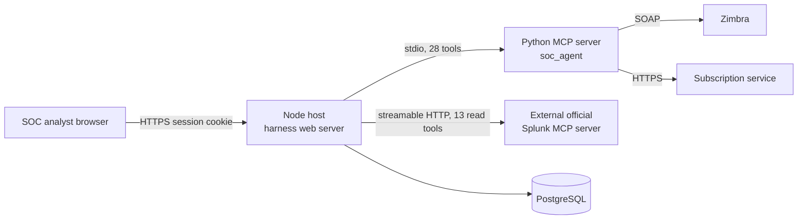

# CITIC_AGENT documentation

> **Verified against:** commit `56c8dd21492a5c36cb9f3eaa3da01160aba40033` (branch `splunk-offical-mcp`, committed 2026-09-12T07:22:44Z) · documentation verified 2026-09-12.
> 语言 / Language: **English** · [中文版](zh/README.md)
> Evidence for every claim is cited by repository path and symbol. See [reference/TRACEABILITY_MATRIX.md](reference/TRACEABILITY_MATRIX.md).

**Who this page is for:** everyone. It is the entry point and reader map for the whole documentation set.

**What you will understand here:** what the CITIC SOC Agent is, which page answers which question, and the smallest useful picture of the system.

**Plain-language summary.** The CITIC SOC Agent is a self-contained, browser-based security-operations assistant. A SOC analyst signs in with their own Zimbra (email) identity and chats with an AI agent ("Sentinel") that can investigate Splunk and read the analyst's mailbox through a strictly allowlisted set of tools. The agent can draft emails but only the human, in the UI, can actually send one. Every tool call is checked against a server-side policy; mutations require approval; Splunk access is read-only. The system runs on a vendored agent harness ("DeepSeek Harness") and adds a Python MCP server (Zimbra + email subscriptions), a client bridge to an external official Splunk MCP endpoint, an authentication/ownership layer, and a settings/admin UI.

**Prerequisites:** none for this page.

---

## One-screen system summary

| Question | Answer |
|---|---|
| What is it? | A web-based SOC investigation assistant with tool-using AI, deployed as one Node host process plus Python child processes. |
| Who uses it? | Authenticated SOC staff (analysts) and an administrator (separate static admin login). |
| Main external systems | Zimbra (mail, identity), an external official Splunk MCP server, a subscription web service, PostgreSQL. |
| Two MCP servers | `soc_agent` — local Python stdio server, Zimbra + subscription tools only (28 tools incl. forward drafts). `splunk_mcp` — a client-side bridge to the external official Splunk MCP endpoint, read-only by allowlist (13 tools). |
| Safety model | Allowlisted tools only; read-only by default; per-tool ask/auto-run/disabled states; Full access vs SOC mode; email delivery only via an explicit UI Send confirmation; harness shell/filesystem tools disabled. |
| Persistence | PostgreSQL (sessions, ownership, encrypted config), per-user workspace directories under `.data/soc-workspaces/`, optional SQLite evidence store, tracked generated browser bundles in each SOC package's `lib/`. |

## Smallest useful architecture diagram

Editable source: [diagrams/system-context.mmd](diagrams/system-context.mmd). Full architecture: [ARCHITECTURE.md](ARCHITECTURE.md).

## Reader map — four fast paths

| You are… | Read in this order | Time |
|---|---|---|
| **New to the product** | [PRODUCT_OVERVIEW.md](PRODUCT_OVERVIEW.md) → [ARCHITECTURE.md](ARCHITECTURE.md) (context level only) → [USER_INTERFACE_AND_ACTION_MODES.md](USER_INTERFACE_AND_ACTION_MODES.md) | ~10 min |
| **A developer** | [GETTING_STARTED.md](GETTING_STARTED.md) → [DEVELOPMENT.md](DEVELOPMENT.md) → [MCP_AND_TOOL_ROUTING.md](MCP_AND_TOOL_ROUTING.md) → [TESTING.md](TESTING.md) → [reference/SOURCE_INDEX.md](reference/SOURCE_INDEX.md) | — |
| **An operator / administrator** | [GETTING_STARTED.md](GETTING_STARTED.md) → [DEPLOYMENT_AND_OPERATIONS.md](DEPLOYMENT_AND_OPERATIONS.md) → [CONFIGURATION.md](CONFIGURATION.md) → [TROUBLESHOOTING.md](TROUBLESHOOTING.md) → [reference/CONFIGURATION_REFERENCE.md](reference/CONFIGURATION_REFERENCE.md) | — |
| **A security reviewer** | [SECURITY_AND_TRUST_BOUNDARIES.md](SECURITY_AND_TRUST_BOUNDARIES.md) → [AUTHENTICATION_AND_OWNERSHIP.md](AUTHENTICATION_AND_OWNERSHIP.md) → [MCP_AND_TOOL_ROUTING.md](MCP_AND_TOOL_ROUTING.md) → [DATA_AND_PERSISTENCE.md](DATA_AND_PERSISTENCE.md) → [reference/TRACEABILITY_MATRIX.md](reference/TRACEABILITY_MATRIX.md) | — |

## Full page index

| Page | Answers |
|---|---|
| [GETTING_STARTED.md](GETTING_STARTED.md) | Prerequisites, safe setup, first verification, first-run failures |
| [PRODUCT_OVERVIEW.md](PRODUCT_OVERVIEW.md) | Business problem, users, workflows, non-goals, terminology |
| [ARCHITECTURE.md](ARCHITECTURE.md) | Context, containers, components, code map, vendor seams |
| [RUNTIME_FLOWS.md](RUNTIME_FLOWS.md) | End-to-end traces: login, Splunk query, Zimbra read, draft/send, subscription, settings change, attachments |
| [MCP_AND_TOOL_ROUTING.md](MCP_AND_TOOL_ROUTING.md) | Tool names, namespaces, allowlists, policy, naming traps |
| [AUTHENTICATION_AND_OWNERSHIP.md](AUTHENTICATION_AND_OWNERSHIP.md) | Login, sessions, identity propagation, ownership, admin auth |
| [SECURITY_AND_TRUST_BOUNDARIES.md](SECURITY_AND_TRUST_BOUNDARIES.md) | Threat-oriented view of every control and residual risk |
| [DATA_AND_PERSISTENCE.md](DATA_AND_PERSISTENCE.md) | Stores, schemas, encryption, retention, ownership of data |
| [USER_INTERFACE_AND_ACTION_MODES.md](USER_INTERFACE_AND_ACTION_MODES.md) | UI areas, Full access vs SOC mode, per-tool states, draft Send |
| [SOC_CLIENT_PLUGINS.md](SOC_CLIENT_PLUGINS.md) | Isolated sidebar/workspace architecture, mandatory core, optional feature plugins, setup, snapshots, and rollback |
| [CONFIGURATION.md](CONFIGURATION.md) | Configuration sources, precedence, secrets, validation |
| [DEVELOPMENT.md](DEVELOPMENT.md) | Layout, toolchain, builds, patches, change recipes |
| [TESTING.md](TESTING.md) | Test layers, how to run, coverage map, gaps |
| [DEPLOYMENT_AND_OPERATIONS.md](DEPLOYMENT_AND_OPERATIONS.md) | Setup doctor, update flow, health checks, operations |
| [TROUBLESHOOTING.md](TROUBLESHOOTING.md) | Symptom → diagnostic → corrective action, per area |
| [DOCUMENTATION_AUDIT.md](DOCUMENTATION_AUDIT.md) | What was verified, what could not be, contradictions, unknowns |
| [reference/](reference/REPOSITORY_MAP.md) | Repository map, component catalog, source index, interface catalog, MCP tool catalog, configuration reference, data-store catalog, test-coverage matrix, traceability matrix, glossary |
| [diagrams/](diagrams/README.md) | Editable Mermaid sources for every diagram |
| [SHORTENING_PLAN_IMPLEMENTATION.md](SHORTENING_PLAN_IMPLEMENTATION.md) | The maintainer's record of the Splunk-stack removal refactor (baseline `d264ca7`) |

## Evidence in the repository

- Product definition and wiring: `apps/soc-agent/cordis.patch.yml`, `apps/soc-agent/package.json`, root `README.md`.
- Tool surface: `apps/soc-agent/policy.js`, `apps/soc-agent/splunk-bridge.js`, `apps/soc-agent/server/unified_mcp_server/server.py`.
- Identity and ownership: `apps/soc-agent/auth-host.js`, `apps/soc-agent/ownership.js`, `apps/soc-agent/server/unified_mcp_server/postgres_store.py`.
- Governing policy (mandatory reading for anyone changing behavior): root `AGENTS.md`.

## Operational warning

This documentation describes a live security system. Nothing in `docs/` authorizes any operational action against Splunk, Zimbra, or the subscription service. Investigation remains read-only by default; changes go through the documented approval flows. See [SECURITY_AND_TRUST_BOUNDARIES.md](SECURITY_AND_TRUST_BOUNDARIES.md).
