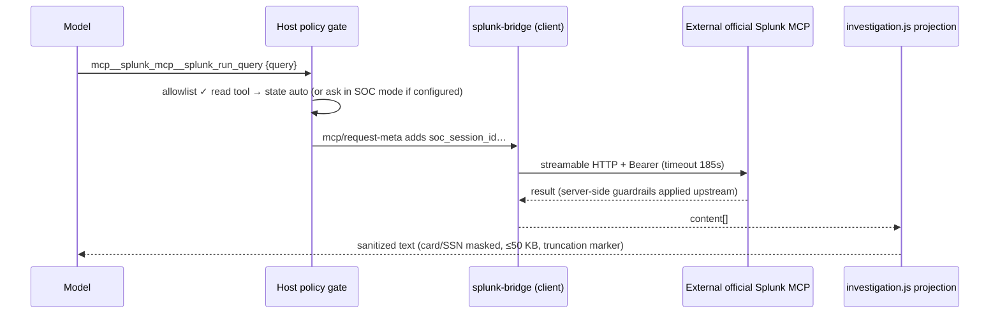

# Runtime flows

> **Verified against:** commit `b26d55d274cf298a456d84edfbcb42b8dc90134b` (branch `splunk-offical-mcp`, committed 2026-09-11T15:35:35Z) · documentation verified 2026-09-12.

**Who this page is for:** developers and reviewers who need to know exactly what happens between "user does X" and "system responds", including the failure branches.

**What you will understand:** fifteen end-to-end traces — installation, startup, login, ownership, tool allowlisting, Splunk reads, Zimbra reads, email draft/send, subscriptions, action modes, admin settings, attachments, skills, output projection, and error handling — each with trigger, participants, authorization, storage, external calls, success, and failure behavior.

**Plain-language summary.** Every flow crosses the same four checkpoints: the browser (convenience only), the scoped host boundary (session/ownership), the tool policy gate (allowlist + mode + per-tool state + approval), and the Python/external boundary (identity + budget + upstream gates). Understanding those four checkpoints makes every flow predictable.

**Prerequisites:** [ARCHITECTURE.md](ARCHITECTURE.md); tool names in [reference/MCP_TOOL_CATALOG.md](reference/MCP_TOOL_CATALOG.md).

---

## 1. Installation / bootstrap and update lifecycle

**Trigger:** operator runs `./setup.sh` (or the bootstrap copy) / `./update.sh`.
**Path:** prerequisites (node/pnpm/uv) → parameter collection (env precedence; secrets via `read -rs`) → write `apps/soc-agent/server/.env` + `vendor/deepseek-harness/.env` (chmod 600) → `uv sync --python 3.12` → fingerprint-gated `pnpm install --frozen-lockfile` + `pnpm run build` (fingerprints in `.data/harness-*.sha256`; `--rebuild` forces) → profile patch copy + plugin add/prune (managed set: `@linxin666/dsh-client-ui-skin-center`, `dsh-auto-collapse`, `dsh-soc-agent`, `dsh-soc-agent-client`) → SOC bundle registration + resolution verification → summary (masked values; starts nothing).
**Failures:** missing prerequisites (loop or record warning); dirty tree blocks branch switch (never stashed); SOC bundle drift (`lib/client.js` require-allowlist) triggers rebuild; `--check` exits 1 with the failing count.
**Evidence:** `setup.sh` stages; `update.sh` (clean-tree ff-only + `--plugins`).

## 2. Development build and application startup

**Trigger:** `pnpm dsh web --no-open`.
**Path:** harness loads the web profile → cordis loader applies `cordis.patch.yml` (disables coding tools, enables skills/plan/ask-user, inserts SOC plugins) → plugins `apply(ctx)`: auth-host (routes, transport fencing, Postgres pool), host (RPC, hooks, admin page, background), bridge (connects `splunk_mcp` if configured; else logs "disabled"), `soc-agent-mcp` (spawns `uv run unified-mcp-server`; `ensureSchema` creates tables; `load_server_env` reads `.env`) → web server listens on 3080.
**Failures:** Python spawn failure is fatal (`failOnStartupError: true`); bridge misconfiguration only disables the bridge; missing `SOC_ADMIN_EMAIL/PASSWORD` throws at auth plugin construction; Postgres unreachable → store degrades to no-op and login fails closed downstream.
**Evidence:** `cordis.patch.yml`; `ownership.js` constructor; `splunk-bridge.js apply`.

## 3. Browser authentication and identity propagation

```mermaid
sequenceDiagram
    participant B as Browser (AuthGate)
    participant H as Node host (ownership.js)
    participant P as auth_cli / control_server
    participant Z as Zimbra
    B->>H: POST /auth/login {email,password}
    H->>H: same-site/origin check; 32 KiB JSON cap
    H->>P: runAuthCommand('login') [session_id-less]
    P->>Z: zimbra_login (SOAP)
    Z-->>P: token
    P->>P: create_user_session (encrypt token, revoke other sessions as new_device_login)
    P-->>H: public_session + replaced_session_ids
    H->>H: revoke replaced sessions (abort streams, clear modes)
    H-->>B: 200 {authenticated, user, workspace} + Set-Cookie soc_session (24h, HttpOnly, SameSite=Lax)
```

**Identity authority:** the Postgres row — every later request resolves `soc_session_id` → `soc_app_sessions` → the user's Zimbra token (`identity_for_session`). **Failures:** invalid credentials → generic 401 `invalid email or password` (password never echoed; malformed Python payload → Node deletes any created session); expired → 401 + lazy row deletion; upstream Zimbra token death mid-conversation → `zimbra_auth_error` deletes the app session (`server.py execute`), forcing re-login; cross-site login attempts → 403.
**Single-device policy:** a new login replaces older sessions; the old device learns the reason exactly once via the one-shot `soc_session_revocations` row (`SESSION_REPLACED_MESSAGE`).
**Evidence:** `ownership.js handleAuthRoute`, `auth_cli.py login`, `postgres_store.py create_user_session`; tests `auth.test.js`, `test_auth.py`.

## 4. Session, workspace, and settings ownership checks

Every API call from the browser passes `createScopedApiProxy`: nine domains (`sessions`, `subagents`, `workspace`, `folders`, `events`, `downloads`, `skills`, `agentPresets`, `goals`) are wrapped with (a) an `authorize` phase that denies cross-user ids (11 mutation methods tested), (b) normalization — `sessions.create` gets a **server-generated** `session-<uuid>` id (no client-chosen id squatting) and defaults to the user's General workspace, (c) post-processing filters for list/read results, and (d) the `respond` guard so approval answers can only target the caller's own pending requests. Workspace paths are single directory names resolved under `MCP_SERVER_ROOT/.data/soc-workspaces/<userId>/` with `realpath` containment (traversal → `workspace-invalid-path`). General workspace cannot be renamed/deleted (`workspace-protected`).
**Evidence:** `ownership.js createScopedApiProxy`, `userWorkspaceRoot`, `isWithinPath`; `auth.test.js` IDOR tests.

## 5. MCP server discovery and tool allowlisting

Three layers, in order: (1) **registration** — `dsh-mcp-client` registers only names in the raw `allowedToolNames` (27 for `soc_agent`; 13 for `splunk_mcp`); (2) **restriction** — on `agent/created` the host best-effort restricts the agent's tool set to `DOMAIN_TOOLS ∪ CONTROL_TOOLS`; (3) **enforcement** — `tools/pre-execute` (global) denies any name outside that union, then applies mode/state logic. Late-arriving MCP tools are caught by layer 3 (the comment says exactly that). Tests pin all three layers and the exact counts (29/41/12).
**Evidence:** `cordis.patch.yml`, `host.js apply` + `savedActionPolicy`, `policy.test.js`, `mcp-discovery.test.js`.

## 6. A read-only Splunk request through `splunk_mcp`



**Identity:** the bridge's service token, not the user's. **Failure branches:** bridge unconfigured → tool never registered (deny at layer 1/3); connection error/timeout → tool error; result over 50 KB → truncated with an explicit marker; `SPLUNK_SANITIZE_OUTPUT=0|false|no|off` disables masking (documented opt-out).
**Evidence:** `splunk-bridge.js`, `investigation.js`, `investigation.test.js`, `splunk-bridge.test.js`.

## 7. A Zimbra read operation through `soc_agent`

Example `zimbra_search_emails`: metadata (`soc_session_id`) arrives → `fresh_runtime` resolves identity from Postgres (missing → `authentication_required`; unknown/expired → `session_expired`) → `operation_budget` opens (min 180 s / `soc_deadline_ms`) → identity-bound `ZimbraMailService` (LRU 32) validates the query **before** the network → SOAP call with the user's token → result shaped by `responses.success` → correlation id logged (`mcp_call ok/failed`).
**Failures:** `query_validation_error` (pre-network), `zimbra_auth_error` (deletes app session → re-login), `zimbra_tls_error`, `zimbra_connection_error` (retryable flag), generic `internal_error` (upstream text withheld — third-party messages can contain credentials/URLs).
**Evidence:** `server.py fresh_runtime/execute`, `zimbra.py soap_request`, `test_zimbra_service.py`.

## 8. Email draft → review → explicit Send

```mermaid
sequenceDiagram
    participant M as Model
    participant S as soc_agent (Python)
    participant U as Draft UI (EmailDraftToolview)
    participant H as Host RPC (host.js)
    participant C as Control channel
    participant Z as Zimbra
    M->>S: zimbra_send_email {to,cc,bcc,subject,body}
    S->>S: validate recipients/subject; build LOCAL draft (no store, no send)
    S-->>U: tool result {draft…} → editable card (status: editing)
    U->>U: user edits; validation (≥1 To, subject non-empty)
    U->>U: window.confirm('Send this email now?')
    U->>H: rpc /soc-agent-config send-email {to[],cc[],bcc[],subject,body,body_format}
    H->>C: runAuthCommand('send-email', {…, session_id})
    C->>Z: ZimbraMailService.send_email (gate ZIMBRA_ALLOW_SEND)
    Z-->>C: sent
    C-->>H: {sent:true}
    H-->>U: result.sent === true → status 'sent'
```

**State machine:** `editing → sending → sent | failed | discarded` (discarded offers Reopen; failure shows the message with a Retry label). **The confirmation is a UI-level control**: the server enforces authentication (`requireUser`), the session-scoped identity, the `ZIMBRA_ALLOW_SEND` gate, and requires Zimbra's own success before reporting `sent`; no separate server-side confirmation token exists. Lost responses after transmission are surfaced as `operation_outcome_unknown` — "Check its result before trying again" — and never replayed. No model-callable tool can deliver email.
**Evidence:** `EmailDraftToolview.tsx`, `host.js send-email`, `auth_cli.py send-email`, `zimbra_service.py send_email`; `email-draft-toolview.test.ts`, `test_zimbra_service.py`, `control-channel.test.js`.

`zimbra_forward_email` uses the same editor and delivery path. It reads one numeric `message_id` in the authenticated mailbox, returns an optional editable note plus a bounded original-message preview, and retains `forward_message_id` through edits. The confirmation states that the original message and all attachments are included. The private command passes the ID to `zimbra-client.forward_message`, which fetches the full original and forwards attachments by MIME-part reference; the shortened preview is never used as the outgoing original body.

## 9. Subscription read, preview, and mutation

Reads (`list_subscriptions`, `get_subscription_schema`, `preview_subscription`) default to auto-run. Previews are dry-runs against the external API (`POST /api/subscriptions/preview`; mode `create|update`; update requires email). Mutations (`create_subscription`, `update_subscription`, `delete_subscription`) are in `ACTION_CATALOG` → default state `ask` → the harness approval flow surfaces them in the UI before execution; the Python client adds `expected`-style validation (email required, ≥1 field for update, non-empty team) and path-escapes the email in URLs. Client lifecycle: form login once per process, exactly one re-login on 401, ≤5 same-host redirects (no downgrades), remote error bodies withheld.
**Evidence:** `email/service.py`, `email/tools.py`, `test_email_service.py`, `policy.js ACTION_CATALOG`.

## 10. Full access vs SOC mode decision behavior

Per tool call: load deployment policy from settings `soc-action-approval`; overlay the session-scoped mode from `socAuth.actionMode(exec)` if present; if mode is `full` → every domain tool delegates (even `disabled` ones); if `soc` → use the per-tool state, defaulting to `ask` for mutations and `auto` for reads. Unknown/invalid settings degrade to SOC defaults ("must never grant an action"). The mode switch UI writes via `set-action-mode` (server-confirmed value adopted; malformed responses fail closed). Session modes live in an in-memory map cleared on logout/revocation/restart.
**Evidence:** `host.js savedActionPolicy` + `policyValue`, `ownership.js setActionMode`, `SocActionPolicyMenu.tsx` + `actionPolicy.ts`; `policy.test.js`, `user-mode.test.js`, `action-policy.test.ts`.

## 11. Admin settings, encrypted persistence, validation, redaction

Admin console → RPC (`get-settings`, `test-splunk`, `test-subscription-server`) → `host.js runAdmin` spawns `uv run python -m unified_mcp_server.admin_cli <command>` (child env **without** `SOC_ADMIN_*`; timeout 185 s → SIGTERM) → stdout JSON parsed. `get-settings` returns only redacted statuses (endpoint hosts via `redact_endpoint`, booleans/limits; no secrets/usernames/mailbox identity). Settings changes from the admin UI go through the harness settings API with `expectedRevision` (optimistic concurrency) into Fernet-encrypted `app_config`. Provider API keys are write-only (`credentials.set`; `describe` returns configured/writable booleans only). Validation/test actions never write configuration — `update-settings`/`delete-setting` refuse by design.
**Evidence:** `host.js runAdmin/parseAdminFailure`, `admin_cli.py`, `config.py public_status`, `postgres_store.py` encryption; `test_config.py`, `sections.test.ts`.

## 12. Attachment retrieval, conversion, display, failure

Two entry points: **mailbox** (`zimbra_get_attachment_text` → bounded download → `AttachmentConverter` with `ZIMBRA_MAX_*` limits) and **composer upload** (client base64 → admin RPC `convert-attachment` with per-request limits; two concurrent workers preserve order and cache successes). Conversion is MarkItDown in-memory (`io.BytesIO`, no temp files), with archive-safety pre-checks (member count ≤1 000, expanded ≤50 MB, encrypted-member detection), UTF-8/JSON/XML validation, and an LRU success cache (64/4 MB). Output carries `text_truncated` and the UI prepends an excerpt notice.
**Failure codes:** `attachment_too_large`, `attachment_unsupported`, `attachment_encrypted`, `attachment_malformed`, `attachment_converter_unavailable`, `attachment_invalid_filename`, `attachment_conversion_failed`, `attachment_conversion_cancelled`; client-side limit errors surface as user-facing messages before any RPC.
**Evidence:** `attachment_converter.py`, `markitdownAttachments.ts`, `host.js validateAttachmentPayload`; `test_zimbra_service.py`, `markitdownAttachments.test.ts`.

## 13. Skills injection and tool authorization

At session start the `citic-soc` preset loads instruction files (`AGENTS.md`, `CLAUDE.md`, `BACKGROUND.md` candidates; 64 KiB cap) and the skill system indexes `skills/` (via `skill-filesystem.customSkillDirs`). The model sees skill summaries and loads a full playbook through the **`skill`** tool — which is itself in `READ_ONLY_TOOLS` (default auto). `BACKGROUND.md` is additionally re-injected as a plugin message every N durable user prompts (default 5, live-adjustable, 0 disables; 64 KiB render cap; suppressible per settings). Skills constrain behavior by instruction only — the real constraint remains the tool policy; the `skill` tool grants no additional tool access.
**Evidence:** preset YAML, `host.js installBackgroundRefresh`, `policy.js` (`skill` entry); `background.test.js`, `skills.test.js`.

## 14. Investigation output projection

`tools/post-execute` (global) applies only to `mcp__splunk_mcp__splunk_*` results that arrive as text blocks: join → mask card/SSN patterns → truncate to 50 000 bytes on UTF-8 boundaries with the marker `\n[official Splunk MCP output truncated by the SOC response limit]`. Other namespaces (including `soc_agent`) pass untouched, as do error results. Rationale (code comment): official Splunk results bypass local query admission, so this is their output boundary.
**Evidence:** `investigation.js`; `investigation.test.js`.

## 15. Error propagation, timeouts, and recovery

| Layer | Mechanism | User-visible result |
|---|---|---|
| MCP call | 185 s client timeout; 180 s server operation budget (`operation_timeout`) | Tool error card; agent may reformulate |
| Python envelope | `ServiceError` → `{ok:false, error:{code,message,retryable,details}}` via `McpFailureEnvelope` (transport marks `isError`) | Structured error the model can act on |
| Unexpected Python exception | Logged **without** third-party text; fixed `internal_error` message | Generic failure, no credential/URL leakage |
| Admin subprocess | 185 s → SIGTERM; stderr JSON `{code,message,details}` parsed (≤400 chars, ≤20 missing-env names) | Prefixed RPC error message |
| Control channel | Lost response after transmission → `operation_outcome_unknown` (no replay); pre-transmission failure → one-shot spawn fallback | "Check its result before trying again." |
| No retries exist in first-party code | — | Failures surface honestly; the agent decides next steps |

**Evidence:** `server.py execute`, `ownership.js` channel guards, `host.js` error mapping; `test_control_server.py`, `control-channel.test.js`.

Related: [diagrams/](diagrams/README.md) for the editable sequence/state diagrams (authentication-sequence, email-draft-send, action-authorization, mcp-routing).

## Evidence in the repository

- Flows 1–2: `setup.sh`, `update.sh`, `apps/soc-agent/cordis.patch.yml`, `splunk-bridge.js apply`
- Flows 3–4: `ownership.js` (`handleAuthRoute`, `createScopedApiProxy`), `auth_cli.py`, `postgres_store.py`
- Flows 5–6: `host.js apply`, `policy.js`, `splunk-bridge.js`, `investigation.js`
- Flows 7–9: `server.py`, `zimbra_service.py`, `zimbra/mail/tools.py`, `email/service.py`
- Flow 10: `host.js savedActionPolicy`, `ownership.js setActionMode`
- Flow 11: `host.js runAdmin`, `admin_cli.py`, `config.py public_status`
- Flows 12–14: `attachment_converter.py`, `markitdownAttachments.ts`, `host.js installBackgroundRefresh`, `investigation.js`
- Flow 15: `server.py execute`, `ownership.js` channel guards; tests per [reference/TEST_COVERAGE_MATRIX.md](reference/TEST_COVERAGE_MATRIX.md)

## Assumptions and unknowns

- Flow order within a single agent turn (model choosing tools) is nondeterministic; the traces describe the contract of each step, not a fixed sequence.
- Upstream harness behavior (reconnect backoff, compaction thresholds) is summarized from vendored source and the preset, not independently re-tested.
