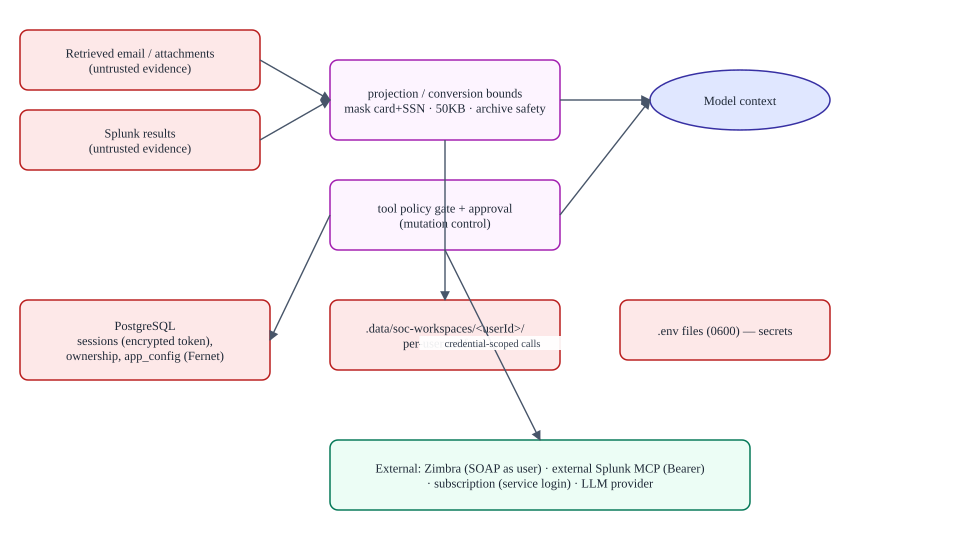
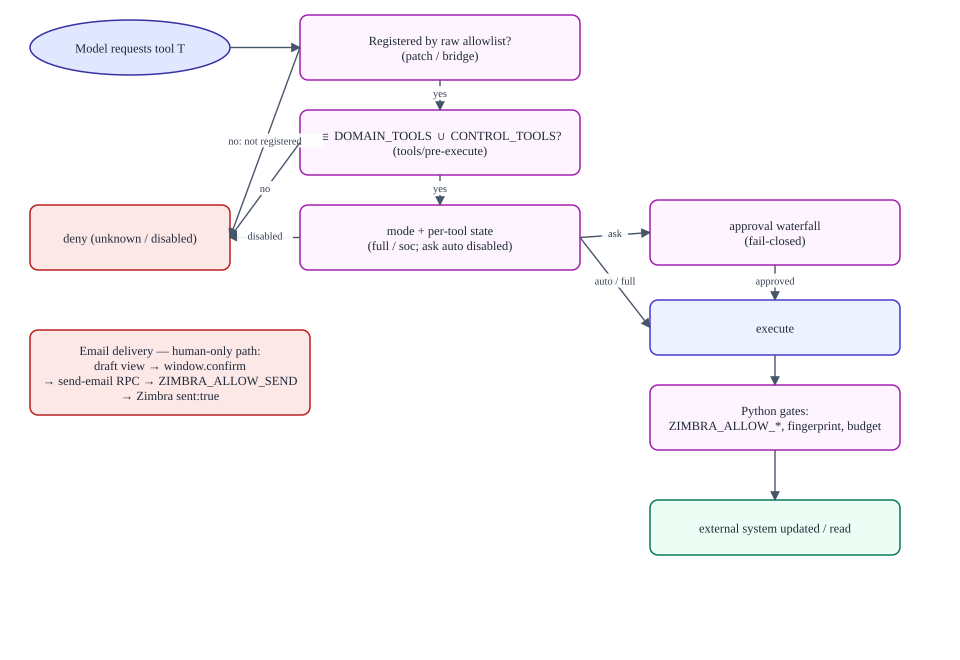

# Security and trust boundaries

> **Verified against:** commit `b26d55d274cf298a456d84edfbcb42b8dc90134b` (branch `splunk-offical-mcp`, committed 2026-09-11T15:35:35Z) · documentation verified 2026-09-12.

**Who this is for:** security reviewers, penetration testers planning authorized assessments, and maintainers making risk decisions.

**What you will understand:** the assets, actors, entry points, and trust zones; every control with its evidence class (documented control / test evidence / defense in depth / operational assumption / recommendation); and the honest residual risks.

**Plain-language summary.** The system's core promise is: a model that can only call an explicitly allowlisted set of tools, as a server-verified user, with human approval for anything that mutates, and no model-accessible path to a shell, a filesystem, or an email send. The controls below are listed with the strength of their evidence — and the places where a determined deployment could still get hurt are listed as residual risks, not hidden.

**Prerequisites:** [AUTHENTICATION_AND_OWNERSHIP.md](AUTHENTICATION_AND_OWNERSHIP.md); [MCP_AND_TOOL_ROUTING.md](MCP_AND_TOOL_ROUTING.md).

---

## 1. Assets, actors, entry points, trust zones

| Asset | Sensitivity | Stored in |
|---|---|---|
| Zimbra session tokens | High — mailbox access as the user | `soc_app_sessions` (Fernet-encrypted) |
| Provider API keys, service secrets | High | `app_config` (Fernet), credentials API (write-only), `.env` (0600) |
| Admin credentials | High | Environment only (never stored, never forwarded to children) |
| Investigation content (mail, Splunk results) | High (customer data) | **Not persisted** by this system; transient in conversations/workspaces |
| Session/ownership claims | Medium | Postgres |
| Conversation artifacts | Medium | Per-user workspace dirs + harness state (`.data/`, `.state/`) |

**Actors:** analyst (authenticated), administrator (authenticated), the model (untrusted instruction-follower), external services (Zimbra, Splunk MCP, subscription, LLM provider), and retrieved content (untrusted evidence).

**Entry points:** HTTP routes (`/auth/*`, `/admin/*`, `/api/*`, `/soc-agent-config`), WebSockets (`/api/events.mux|host`), MCP stdio pipes (parent-child), the control channel pipe, and the CLI entry points (operator-local).

**Trust zones:** browser (untrusted) · Node host (trusted core) · Python children (trusted, narrower) · external services (semi-trusted, credential-scoped) · model/retrieved content (untrusted).

## 2. Control inventory (with evidence class)

### Identity and session

| Control | Class | Evidence |
|---|---|---|
| Zimbra-backed login; generic failures; no password echo | Documented + **test evidence** | `auth.test.js`, `test_auth.py` |
| 24 h server-side session expiry; HttpOnly/SameSite=Lax(+Secure) cookies | Documented + test evidence | `auth.test.js`; `ownership.js` |
| Single-device replacement with one-shot revocation notice | Documented + test evidence | `auth.test.js` ("revoking an application session…") |
| Admin: env credentials required at startup, timing-safe compare, hashed in-memory tokens, 8 h TTL | Documented + test evidence | `auth.test.js` (startup + cookie tests) |
| Admin/user cookie segregation across API tiers | Documented + test evidence | `auth.test.js` ("admin cookies cannot authorize chat APIs…") |
| CSRF posture: same-site/origin checks on auth routes; SameSite=Lax cookies | Documented control | `ownership.js sameSiteRequest` (no dedicated CSRF test — see residual risks) |

### Isolation

| Control | Class | Evidence |
|---|---|---|
| Ownership claims in Postgres; scoped API proxy for 9 domains; 11 cross-user mutations denied | Documented + **test evidence** | `auth.test.js` IDOR tests |
| Workspace path containment (traversal/symlink escape rejected) | Documented + test evidence | `auth.test.js` workspace tests |
| Server-generated session ids (no squatting) | Documented + test evidence | `auth.test.js` |
| Event-stream filtering/redaction (credential refs, foreign sessions, stream errors) | Documented + test evidence | `auth.test.js` |
| Approval answers bound to the caller's pending requests | Documented + test evidence | `auth.test.js` ("scoped response handling…") |
| Customer data separation | Operational assumption (policy in `AGENTS.md`; no cross-customer state exists to leak) | `AGENTS.md` |

### Tools and mutations

| Control | Class | Evidence |
|---|---|---|
| Raw per-server allowlists (`allowedToolNames`) | Documented + test evidence | `mcp-discovery.test.js`, `skills.test.js`, `splunk-bridge.test.js` |
| Exact-name host policy gate; deny unknown tools | Documented + **test evidence** | `policy.test.js` |
| Action modes cannot expand the allowlist (Full access only changes handling) | Documented + test evidence | `policy.test.js` ("full access bypasses SOC action states…" — bypass *of states*, not of the allowlist) |
| Mutations default `ask`; harness approval waterfall fail-closed | Documented + test evidence | `policy.test.js`; upstream approval plugin (documented control) |
| MCP-side mutation gates (`ZIMBRA_ALLOW_*`) + filter fingerprints | Documented + test evidence | `test_zimbra_service.py`, `test_zimbra_filters.py` (defense in depth with the UI layer) |
| Email: draft-only tool; UI confirm; service gate; `sent:true` verification | Documented; **UI confirm is a UI-level control** | `EmailDraftToolview.tsx`, `auth_cli.py`, `test_zimbra_service.py` |
| No Splunk mutation tools (bridge read-only by allowlist; retained modules unregistered) | Documented + test evidence | `test_server_tools.py`, `splunk-bridge.test.js` |
| Read-only Splunk boundary composition | Documented control | The bridge has no protocol-level write filter — the boundary is the allowlist + policy + remote server (see residual risks) |

### Content handling

| Control | Class | Evidence |
|---|---|---|
| Splunk output projection: PII masking + 50 KB truncation | Documented + test evidence | `investigation.test.js` |
| Instruction-in-data resistance (`AGENTS.md` model policy) | Operational assumption | Model-level; no technical guarantee possible |
| Untrusted-content boundary for tool results | Documented control | Envelopes + generic `internal_error` (no third-party text leakage) |
| Background/background-instruction caps (64 KiB render, 1 MiB source) | Documented + test evidence | `background.test.js` |
| Attachment conversion bounds + archive safety + encrypted-file detection | Documented + test evidence | `test_zimbra_service.py`, client tests |
| Remote error bodies withheld (subscription), upstream exception text withheld (Python) | Documented + test evidence | `test_email_service.py`, `test_config.py` |

### Platform

| Control | Class | Evidence |
|---|---|---|
| Model-facing shell/fs/subagent/job/goal tools disabled via patch | Documented + **test evidence** | `skills.test.js` ("SOC profile disables native shell…") |
| Skills confined to `skills/` via `customSkillDirs` | Documented + test evidence | `skills.test.js` |
| Secrets excluded from child processes | Documented + test evidence | `auth.test.js` ("without exposing tokens") |
| SQL bounds on session ids; encrypted columns; `statement_timeout=15000` | Documented control | `postgres_store.py` |
| TLS verification defaults (bridge, Zimbra, subscription) | Documented + test evidence | `splunk-bridge.test.js` ("verifies TLS by default"), `test_splunk_service.py` |
| Log hygiene: no secrets or third-party exception text in logs; per-call correlation ids | Documented + test evidence | `server.py execute` (upstream text withheld), `redact_endpoint`, `adminFailureMessage` (≤400 chars); correlation via `soc_correlation_id` |
| Dependency pinning: vendored harness (workspace), pinned `markitdown==0.1.7`, commit-pinned external plugin + local patch | Documented control | `pyproject.toml`, `requirements.txt`, `patches/` |

## 3. Threat scenarios and how they are contained

| Scenario | Containment |
|---|---|
| Prompt injection via a phishing email ("delete all filters") | Retrieved content is evidence, not instructions (`AGENTS.md`); any filter mutation is an `ask` action requiring the human; the model has no hidden tools |
| Model attempts an unregistered tool (e.g. `bash`) | Denied three times: not registered (registry), not in restricted set, not in `DOMAIN_TOOLS` (`policy.test.js` denies `bash` explicitly) |
| Stolen analyst cookie | HttpOnly + SameSite + server-side expiry; single-device policy revokes on next login; revocation aborts live streams |
| Stolen admin cookie | 8 h in-memory only; dies with host restart; admin surface limited to status/approvals/providers |
| Cross-user session/workspace access (IDOR) | Scoped proxy denies/filters; ownership claims double-checked (`sessionBelongsToUser`) |
| Malicious attachment (zip bomb, encrypted, huge) | Size/char limits, archive member/expanded-size checks, encrypted detection, in-memory only, bounded workers |
| Compromised external Splunk MCP server | Can only return data — which is sanitized/truncated before the model and is evidence-only; it receives only the service token |
| Insider with repo access | No secrets in repo (`.env` ignored; `.env.example` placeholder shapes only); docs never contain live values |

## 4. Residual risks, unknowns, and recommendations

1. **Splunk read-only is compositional, not protocol-enforced.** The bridge would register whatever its allowlist names; if someone added a write name to both the bridge and the patch, only tests and review would catch it. *Recommendation:* keep `skills.test.js`/`splunk-bridge.test.js` as release gates.
2. **Send confirmation is UI-level.** The server authenticates, gates, and verifies delivery, but does not require a per-send confirmation token; a non-browser client with a valid session could call `send-email` without the dialog. *Recommendation (product decision):* server-side confirmation token if the threat model requires it.
3. **No CSRF tokens beyond SameSite/Origin checks** on auth routes; other POST routes rely on fencing + JSON content types. *Recommendation:* keep an eye on browser policy changes; consider explicit CSRF tokens for state-changing routes if the deployment adds third-party origins.
4. **Retained Splunk code is one `register_tools` call away from live.** Its tests prove its contracts, not its absence. *Recommendation:* treat `test_server_tools.py` as a release gate; delete retained code when its history value expires.
5. **No CI at the repo root** — the guards above run only if someone runs them. *Recommendation:* wire the three suites into CI.
6. **`lib/` is tracked generated output** — a compromised or stale bundle ships silently. Setup's require-allowlist check mitigates; *recommendation:* verify bundle drift in review.
7. **`hi.txt`** — an unclassified tracked artifact (Splunk alert-action template). *Recommendation:* delete or document it.
8. **Unknowns:** external service guardrails (Splunk MCP server policy, Zimbra hardening, subscription service) are outside this repo; reverse-proxy topology effects on cookie flags are environment-specific.

## 5. Diagram

 — decision tree from tool call to allow/deny/ask. Source: [diagrams/action-authorization.mmd](diagrams/action-authorization.mmd).

## Evidence in the repository

- Every table above cites test names; run [TESTING.md](TESTING.md) to reproduce.
- Governing policy: `AGENTS.md` (mandatory), `BACKGROUND.md` (evidence caveats).
- Claim-level mapping: [reference/TRACEABILITY_MATRIX.md](reference/TRACEABILITY_MATRIX.md).
