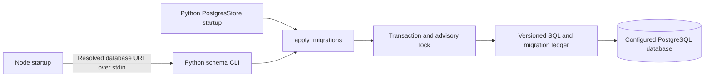

# Shortening plan: implementation and validation

Implementation date: **12 September 2026**. Baseline: commit
`d264ca7b8a29f3dd817b926b3ced531382deac3c` on `splunk-offical-mcp`.
This report describes the working-tree implementation against that baseline;
it does not record a production deployment.

The refactor completes the application's move to the direct official Splunk
MCP bridge and removes the inactive Python Splunk stack. It also consolidates
setup fields, Zimbra identity handling, tool policy inventories, admin UI
behavior, Python subprocess handling, and database schema initialization.

## Results and scope

| Measure | Before | After | Reduction |
| --- | ---: | ---: | ---: |
| Application source files | 105 | 73 | 32 |
| Application source lines | 23,529 | 13,264 | 10,265 (43.6%) |

These counts include comments and blank lines in `.js`, `.ts`, `.tsx`, `.py`,
`.css`, `.sh`, and `.sql` files. They exclude tests, documentation, generated
`lib` output, and `vendor`. The baseline uses Git-tracked source at the commit
above; the after-count includes the new source files in this implementation.
New SQL migrations are included. This is a code-size measurement, not a claim
of improved runtime speed or a measured reduction in memory use.

| Plan item | Implemented result |
| --- | --- |
| 1. Splunk health check and Python retirement | Admin checks use the live official bridge; inactive Python Splunk modules, configuration, package entries, and tests were removed. |
| 2. Setup and readiness | Official endpoint/token are required; one setup field inventory drives prompting and checking. |
| 3. Zimbra consolidation | Mail and filters share one identity/configuration owner; legacy account compatibility remains. |
| 4. Tool inventory | Bridge allowlist and policy categories derive from shared inventories without changing their contents. |
| 5. Admin UI | Removed unused settings components and shared repeated request/status behavior. |
| 6. Subprocess plumbing | One helper handles one-shot Python commands; persistent control-channel delivery rules remain separate. |
| 7. Database schema | Python owns packaged, versioned SQL migrations used by both runtimes. |
| 8. Generated output and vendor packaging | Deferred as planned; runtime bundles remain tracked and were rebuilt, and the vendored harness remains in place. |

## 1. Splunk uses the official bridge throughout

Previously, the agent already used the Node bridge, but the admin connection
check constructed the Python `SplunkService` facade and its legacy services.
The authenticated admin `test-splunk` endpoint now calls
`testOfficialSplunkConnection()`, which executes
`mcp__splunk_mcp__splunk_get_info` through the live tool registry.

The probe uses the same registered bridge as the agent. It checks that the
connection is configured and the tool is available, forwards cancellation,
and applies a 185-second deadline. Failures remain failures in the admin UI;
the diagnostic is bounded and redacts the configured bearer token. Successful
checks return connection status rather than the instance information returned
by the remote tool. Admin authentication is checked before dispatch.

The following Python implementation was removed:

- `splunk_service.py` and the entire `unified_mcp_server/splunk/` tree;
- the `detection.py` facade and detection/compiler helpers;
- legacy REST and Python official-MCP clients;
- search planning, execution, evidence storage, lookup, local query-policy,
  resource-admission, and security-queue implementations;
- the Python admin `test-splunk` command, retired package declarations, and
  tests that exercised only the removed implementation.

Repository callers were checked before removal. The admin probe was the only
active caller of `SplunkService`; external Python consumers could not be
verified. Imports of the removed modules are no longer supported.

The Python server continues to register only its **27 Zimbra/subscription
tools**. The official bridge retains exactly **13 Splunk read tools**. Splunk
mutation tools and a REST fallback were not added. Provider-side Splunk query
guardrails remain the responsibility of the separately deployed official MCP
service; the host's existing output projection remains in place.

Sources: [bridge](../apps/soc-agent/splunk-bridge.js),
[host endpoint](../apps/soc-agent/host.js),
[Python admin CLI](../apps/soc-agent/server/unified_mcp_server/admin_cli.py),
[Python package manifest](../apps/soc-agent/server/pyproject.toml).

## 2. Setup and readiness match the active connection

The remaining Splunk settings are:

| Setting | Default | Purpose |
| --- | --- | --- |
| `SPLUNK_MCP_ENDPOINT` | Empty | Required official HTTP(S) MCP endpoint. |
| `SPLUNK_TOKEN` | Empty | Required bearer token; treated as a secret. |
| `SPLUNK_VERIFY_SSL` | `true` | Certificate verification for the Splunk connection. |
| `SPLUNK_ALLOW_INSECURE_HTTP` | `false` | Explicit opt-in for a plain HTTP endpoint. |
| `SPLUNK_SANITIZE_OUTPUT` | `true` | Retained setting for the existing Splunk output sanitization behavior. |

The bridge is disabled if either endpoint or token is absent. Python readiness
also requires both. A `configured`/`ready` status records configuration
presence, not successful network connectivity; the admin **Check connection**
action performs the read probe. Endpoints must not contain embedded
credentials, query parameters, or fragments. TLS verification exceptions
remain scoped to the Splunk connection.

`setup.sh` now defines 19 collected fields once, including each field's label,
validator, default, secret flag, optional enabling condition, and HTTP opt-in.
That inventory drives prompting, `--check`, server environment updates, and
the redacted summary. It covers PostgreSQL, encryption, admin credentials,
Splunk, Zimbra, subscriptions, and optional MarkItDown LLM credentials.
PostgreSQL connection URIs are treated as secrets in prompts and summaries.

The bootstrap, branch selection, clean-working-tree protection, dependency
installation, environment serialization, and build fingerprint logic remain.
The endpoint prompt also works when the operator skips installing Node:
basic validation runs in Bash, with the Node URL parser used when available.

Legacy REST authentication, planner, lookup, resource, and query-policy fields
were removed from the Python settings model and `.env.example`. Existing
deployment `.env` files were not edited during implementation. Old entries may
remain in those files, but they do not restore the retired Splunk behavior.

Sources: [setup](../setup.sh),
[environment example](../apps/soc-agent/server/.env.example),
[settings and status](../apps/soc-agent/server/unified_mcp_server/config.py),
[output projection](../apps/soc-agent/investigation.js).

## 3. Zimbra has one identity/configuration owner

`ZimbraMailService` and `ZimbraFilterService` now inherit account resolution and
connection configuration directly from `ZimbraCore`. Mail operations live in
the mail service, and common upstream/query error translation lives in
`zimbra/errors.py`. The former `zimbra_service.py` implementation is now a
small compatibility import for `ZimbraService`.

The authenticated runtime reuses an empty account adapter instead of defining
another one. Authenticated services still reject mailbox selection and use
the server-side Zimbra identity. Legacy file-backed accounts, PostgreSQL
account CRUD, and stored-account migration support remain available for
compatibility; the active MCP runtime does not expose them as account-selection
tools. Stored account rows were not deleted.

A related bug was fixed while consolidating the services: applying a
signature to a draft no longer passes the internally resolved `authenticated`
account identifier back into the mailbox-selection validator. It passes the
original validated account argument, allowing the authenticated user to
prepare a signed draft without enabling account selection.

Session expiry/invalidation, attachment handling, deadline checks, filter
fingerprints, and filter-write permissions remain at their existing execution
boundaries. Preparing a draft still does not deliver email.

Sources: [shared core](../apps/soc-agent/server/unified_mcp_server/zimbra/core/service.py),
[mail](../apps/soc-agent/server/unified_mcp_server/zimbra/mail/service.py),
[filters](../apps/soc-agent/server/unified_mcp_server/zimbra/filters/service.py),
[shared errors](../apps/soc-agent/server/unified_mcp_server/zimbra/errors.py),
[compatibility import](../apps/soc-agent/server/unified_mcp_server/zimbra_service.py).

## 4. Tool policy derives from shared inventories

The dependency-free `tool-inventory.js` owns the raw official Splunk names,
managed tool names/labels/groups/behavior, and subscription read names.
The bridge consumes the raw Splunk inventory. `policy.js` derives prefixed
Splunk names, read/action sets, managed tool names, and admin choices.

The resulting exported names, ordering, labels, categories, and sets were
compared with the baseline and match. This consolidates the JavaScript
inventories; Python tool registration and the YAML MCP allowlist still have
their own declarations, checked by contract tests.

`zimbra_send_email` and `zimbra_use_signature_on_email` remain draft-preparation
capabilities in the read category. Actual delivery remains the separate
`ui__soc_agent__send_email` capability requiring explicit UI confirmation.
SOC/full mode behavior and per-session overrides were preserved.

Sources: [inventory](../apps/soc-agent/tool-inventory.js),
[derived policy](../apps/soc-agent/policy.js),
[MCP profile](../apps/soc-agent/cordis.patch.yml).

## 5. Admin UI removes unused code and shares behavior

The unmounted `SplunkSettings` and `SubscriptionServerSettings` components and
their exports were removed after checking repository consumers. Unused
`TextInput`, `SettingRow`, `TestStatus`, related types, and unused overlay CSS
were also removed. The Zimbra compatibility card and its required styles remain.

Within `AdminConsole`, `describeSettings()` shares settings-response parsing,
`useStatus()` shares pending/error handling, and `StatusNotice` shares status
and retry rendering. Provider-specific validation and save operations remain
explicit. The refactor preserves `expectedRevision` conflict detection and
the mounted, visited pages that retain unfinished forms when switching tabs.

DOM tests cover loading failure/retry, pending controls, status/error roles,
revision payloads/conflicts, provider validation, protected Send confirmation,
and unfinished form retention. Source-string assertions that depended on the
old rendering layout were replaced where necessary.

The client build regenerated the tracked runtime bundle and source map.
Generated files remain part of the package's runtime contract and are excluded
from the source-reduction measurement.

Sources: [admin console](../packages/soc-agent-client/src/client/AdminConsole.tsx),
[shared settings helpers](../packages/soc-agent-client/src/client/settings-common.ts),
[client entry](../packages/soc-agent-client/src/client/index.ts),
[DOM tests](../packages/soc-agent-client/tests/admin-console.test.ts).

## 6. One-shot Python commands share process handling

`python-command.js` supplies `runPythonCommand()` and `pythonEnvironment()`.
The helper handles module/command arguments, optional payloads, working
directory, environment filtering, timeout, cancellation, output collection,
JSON parsing, and cleanup. Admin and authentication callers retain their own
error mappings and authorization checks.

The Node-only `SOC_ADMIN_EMAIL` and `SOC_ADMIN_PASSWORD` variables are removed
from child environments. Payloads go over standard input, and command
arguments are passed directly without shell evaluation. Pre-cancelled calls
do not start a child; input-stream errors also settle the request.

The persistent control channel remains in `ownership.js`. Its distinction
between failure before transmission and an uncertain result after transmission
was preserved. A lost response after sending a request returns
`operation_outcome_unknown`; it does not trigger a fresh CLI call that could
deliver an email twice.

Sources: [shared helper](../apps/soc-agent/python-command.js),
[admin caller](../apps/soc-agent/host.js),
[authentication and control channel](../apps/soc-agent/ownership.js),
[delivery contract tests](../apps/soc-agent/tests/control-channel.test.js).

## 7. Python owns versioned database migrations

The duplicated Node/Python table declarations were replaced by
`unified_mcp_server/schema.py` and two packaged SQL migrations:

| Migration | Behavior |
| --- | --- |
| `001_initial.sql` | Creates/adopts the nine existing tables and four session/ownership indexes using `IF NOT EXISTS`. |
| `002_remove_catalog.sql` | Retains the previous obsolete-catalog cleanup, guarded by the existing `catalog-feature-removed-v1` bootstrap marker. |



Both callers run migrations within a PostgreSQL transaction. An advisory
transaction lock serializes startup; `soc_schema_migrations` records each SQL
filename in the same transaction as its changes. Failed SQL rolls back the
new ledger entries and changes, allowing a later retry.

Node `SocStateStore.ensureSchema()` delegates to the Python CLI using the
exact URI resolved for its own pool. The CLI intentionally does not load
`.env`, which could replace that target. It emits a fixed error message on
failure without printing the URI. Python `PostgresStore._ensure_schema()`
calls the same migration function. SQL files are included in the Python wheel
through package-data configuration.

Existing users, encrypted sessions, workspace/session/folder ownership,
settings, and legacy stored accounts are adopted rather than replaced. The
catalog migration is an exception: it preserves the **existing** removal of
obsolete catalog tables when their bootstrap marker is absent. It does not
use `CASCADE`; an external dependency can cause initialization to fail and
roll back. If the marker already exists, those drops are skipped.

Authorization checks and ownership queries remain in their respective Node
and Python execution paths. Sharing the schema does not merge their
authorization responsibilities. Future schema changes should use a new SQL
migration filename; editing an already-recorded migration will not reapply it.
Automatic down migrations were not added.

Sources: [migration owner](../apps/soc-agent/server/unified_mcp_server/schema.py),
[initial schema](../apps/soc-agent/server/unified_mcp_server/migrations/001_initial.sql),
[catalog migration](../apps/soc-agent/server/unified_mcp_server/migrations/002_remove_catalog.sql),
[Python store](../apps/soc-agent/server/unified_mcp_server/postgres_store.py),
[database integration tests](../apps/soc-agent/server/unified_mcp_server/tests/test_schema.py).

## Validation recorded during implementation

The implementation run completed **88 tests**, with no failures or skips in
the final suites:

| Suite | Result | Main contracts exercised |
| --- | --- | --- |
| Node application | 35 passed | Admin/user isolation, expiry/revocation, scoped streams, tool policy, session modes, context refresh, bridge health/configuration, subprocesses, control-channel delivery, and five isolated setup checks. |
| Python backend | 43 passed | Tool exposure, configuration, authentication, mail, signatures, filters, attachments, subscriptions, storage, control server, and three temporary-PostgreSQL integration checks. |
| Client | 10 passed | Admin forms, action policy, draft UI, attachment handling, and client sections. |

Additional checks completed:

- All 27 Python tool input schemas and descriptions matched the baseline
  exactly in an isolated import comparison.
- The JavaScript policy exports matched the baseline, including names, order,
  labels, categories, and sets. The 13-name official Splunk allowlist remained.
- The admin probe was exercised through the built Harness `ToolRuntime` and
  host policy, including cancellation before dispatch.
- Temporary PostgreSQL tests verified concurrent startup, existing data and
  index preservation, bootstrap-marker behavior, rollback/retry, and Node
  startup targeting its supplied database despite a different ambient URI.
- The client build and TypeScript check passed. The Python wheel contained
  both SQL migrations and none of the retired Splunk packages.
- Shell syntax and `git diff --check` passed.

These are implementation-session results, not new runs performed solely to
write this document. Setup tests used synthetic configuration and did not
run the deployment setup workflow. PostgreSQL tests created isolated local
clusters; they did not use the application's database. The tests for removed
Python Splunk features were removed with those features, so total test counts
are not a coverage comparison with the old repository.

### Reproducing the checks

From the repository root, with the existing dependencies installed:

```bash
node --test apps/soc-agent/tests/*.test.js
bash -n setup.sh
git diff --check
```

From `apps/soc-agent/server`:

```bash
.venv/bin/python -m pytest
```

From `packages/soc-agent-client`:

```bash
npm test
npm run build
node ../../vendor/deepseek-harness/node_modules/typescript/bin/tsc --noEmit
```

Setup behavior tests require Bash 4 or newer. Database integration tests
require `initdb`, `pg_ctl`, and a non-root user; the Node startup integration
check additionally requires Node and `uv`. Those tests skip when their
prerequisites are unavailable. The build command updates the generated client
files. These commands reproduce the maintained suites; the baseline
schema/policy comparisons were separate one-off validation checks.

## Deployment implications and remaining work

Deployment and live integration checks remain operator work; no live Splunk,
Zimbra, subscription service, or application database was accessed to validate
this implementation.

1. REST-only deployments must supply a valid official MCP endpoint and bearer
   token. The old REST environment fields no longer provide Splunk tools.
   Restart the host/backend after changing deployment configuration.
2. Ship the new JavaScript helpers and Python SQL package data with the release,
   and rebuild the client using the normal repository build process. Node
   schema startup now needs the installed Python runtime and `uv` helper path.
3. On startup, both runtimes use the shared migrations automatically. Existing
   catalog-cleanup behavior and any external table dependencies should be
   understood before deploying; there is no automatic database downgrade.
4. After deployment, an authenticated administrator should use **Check
   connection** to verify the real official MCP service. Live mailbox,
   subscription, and delivery behavior was not exercised by the offline tests.

The legacy Zimbra account storage/API compatibility paths remain until their
migration needs and external consumers are established. External callers of
the removed Python Splunk APIs or client settings exports must migrate;
repository searches cannot establish their absence outside this checkout.

Moving generated bundles out of Git and replacing the vendored Harness with
a pinned external package/fork remain separate packaging work. Neither was
counted as an application-logic reduction or performed here.
