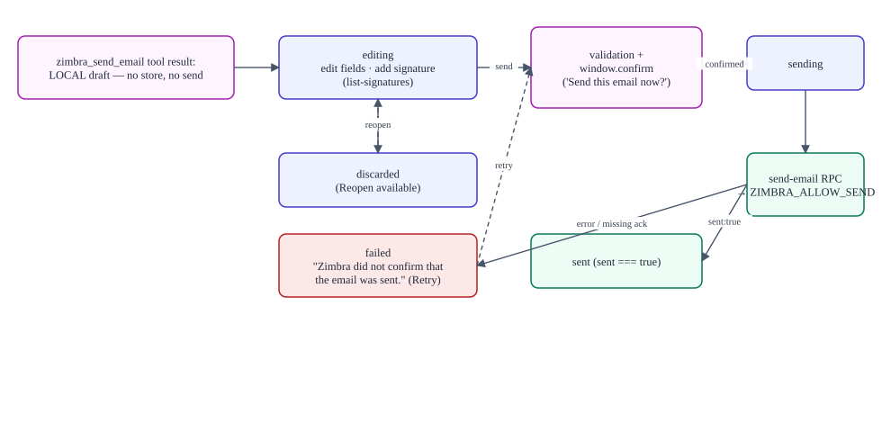

# User interface and action modes

> **Verified against:** commit `b26d55d274cf298a456d84edfbcb42b8dc90134b` (branch `splunk-offical-mcp`, committed 2026-09-11T15:35:35Z) · documentation verified 2026-09-12.

**Who this is for:** analysts using the product, admins configuring it, and developers changing the UI.

**What you will understand:** every UI area, what each control does, which decisions are mere convenience and which are backed by server enforcement, and the exact semantics of Full access, SOC mode, per-tool states, and the email Send confirmation.

**Plain-language summary.** The browser has two apps: the analyst workspace (login overlay, chat with attachments, an action-mode menu, and the email draft card) and the standalone admin console at `/admin` (status, agent context, access & approvals, AI providers). The UI is honest about limits: it shows status without secrets, disables what the server forbids, and never treats itself as the enforcer.

**Prerequisites:** none; tool names from [reference/MCP_TOOL_CATALOG.md](reference/MCP_TOOL_CATALOG.md).

---

## 1. Analyst workspace

| Area | Component | Behavior |
|---|---|---|
| **Sign-in gate** | `AuthGate.tsx` | Full-screen "Sentinel login" dialog rendered above the shell (slot priority −100) until authenticated; polls `GET /auth/me` every 30 s and on focus/visibility change; failed logins show "Invalid email or password." in a `role="alert"`; password field cleared on success *and* failure; authenticated state shows the user's `zimbra_email` with Logout. Server enforcement: all routes are fenced regardless of the overlay. |
| **Brand** | `CiticBrand.tsx` | "Sentinel" mark/wordmark in sidebar and hero (convenience). |
| **Composer attachments** | `MarkItDownDocuments.tsx` + `markitdownAttachments.ts` | Hidden file picker (also via the `attach-file` command); per-message rail with statuses Queued/Converting…/Ready/error; limits from settings (defaults: 5 files, 10 MB/file, 50 MB total, 200 k chars/file, 500 k total); conversion via `convert-attachment` with **two workers**, order preserved, successes cached per limits; truncated results flagged in the excerpt. |
| **Action-mode menu** | `SocActionPolicyMenu.tsx` | Composer-left menu offering **Full access** ("Run every permitted tool directly") and **SOC mode** ("Apply each tool's ask, auto-run, or disabled setting"). Reads/writes via `get-action-policy`/`set-action-mode`; server-confirmed value adopted; malformed responses fail closed (no invented mode). Session-scoped: reset to the deployment default on logout or host restart. |
| **Draft card** | `EmailDraftToolview.tsx` | Renders inside the tool-call block for both draft tools. See §3. |
| **Sessions/permissions** | Harness shell | The scoped server API makes folders server-owned (`api.folders = undefined` client-side) — session creation lands in the user's server-side workspace. |

## 2. Admin console (`/admin`)

Mounted **only** when `window.location.pathname` starts with `/admin` (enforced by source guardrail `sections.test.ts`). Separate login (`soc_admin_session`). Pages (hash-routed, lazily mounted):

| Page | Controls | Server behavior |
|---|---|---|
| **Connections** | Splunk card with *Check* (`test-splunk`), Zimbra/MarkItDown "Environment managed" cards, Subscription card with *Check* (`test-subscription-server`); status pills Checking…/Connected/Unavailable/Configured/Not configured | `get-settings` returns **status only**; "Configuration stays in the server .env file" — no values are editable here |
| **Agent context** | BACKGROUND.md injection toggle + `repeatEveryUserPrompts` (≥0, default 5); time-context injection toggle + interval | `settings.mutate` on `soc-background`/`time-context` with revision check; live-applied |
| **Access & approvals** | Deployment mode radios **Full access / SOC mode**; per-tool radio groups **Ask / Run automatically / Disabled** grouped by tool; UI-confirmed entry shows a read-only "Explicit confirmation" badge; disabled tools show "Unavailable" | Writes `soc-action-approval` (`mode` + `actionStates`) with revision check; enforced by `host.js tools/pre-execute`; page hint: "Email delivery still requires the explicit Send confirmation in the draft view" |
| **AI providers** | Provider picker (listbox) with credential dots and model counts; custom providers (route-validated, immutable route); API key password field ("Stored securely · enter a new key to replace it"); **Discover models** via `llm.discoverModels`; remove = two-step inline confirm | Keys are **write-only** (`credentials.set/unset`; `describe` returns configured/writable booleans only); settings in `llm-pi-ai` namespace |

Legacy compatibility cards (`SplunkSettings`, `SubscriptionServerSettings`, `ZimbraSettings`) still exist in the bundle but `AdminConsole` is tested not to import them.

## 3. The email draft card and the Send gate

State machine: `editing → sending → sent | failed | discarded` (plus Reopen from discarded, and Retry labeling after a failed send).

1. The model calls `zimbra_send_email` (or `zimbra_use_signature_on_email`) → the **local draft** arrives as the tool result → the card renders an editable form (To/CC/BCC with separator-aware parsing and dedupe; subject ≤998; body ≤18 000; text/HTML body format).
2. **Add signature** loads `list-signatures` and merges the chosen signature above/below the body in the signature's format.
3. On Send: client validation (≥1 To recipient, non-empty subject) → **`window.confirm('Send this email now?')`** → RPC `send-email` with the exact fields.
4. The card flips to "Email sent successfully" **only** if the response satisfies `result.sent === true`; anything else becomes a `failed` card with the error in a `role="alert"`. "Zimbra did not confirm that the email was sent." is the explicit failure when the acknowledgment is missing.

**Convenience vs enforcement:** the `window.confirm` dialog is a UI-level control. The server enforces: user authentication on the RPC, session-scoped identity, the `ZIMBRA_ALLOW_SEND` gate, and the Zimbra acknowledgment before reporting success. There is no server-side confirmation token (documented in [TRACEABILITY_MATRIX](reference/TRACEABILITY_MATRIX.md) #32). The model has **no** path to send email — the tool it has builds drafts only.

## 4. Convenience vs enforcement (summary table)

| UI decision | Backed by server enforcement? |
|---|---|
| Login overlay visibility | Yes — routes/transport fenced independently |
| Attachment client-side limits | Partly — client pre-checks; server limits (`attachment_*` codes) are authoritative |
| Action-mode switch | Yes — `set-action-mode` validated + in-memory per-session map; policy gate enforces states |
| Admin per-tool checklist | Yes — settings are the source the gate reads |
| Draft card validation (recipients/subject) | Partly — Python validates recipients/subject again at draft creation; send validates at delivery |
| Send confirmation dialog | **UI-only**; server enforces auth + gate + acknowledgment instead |
| Status cards (Splunk/subscription) | Yes — redacted statuses come from server; configuration is not UI-editable by design |

## Evidence in the repository

- `packages/soc-agent-client/src/client/` — all components listed above; `sections.test.ts` pins mounting, copy, and write-only credential behavior.
- `apps/soc-agent/host.js` (`get/set` policy endpoints, `requireUser/requireAdmin`), `apps/soc-agent/ownership.js` (session mode map).
- Diagram: [diagrams/action-authorization.mmd](diagrams/action-authorization.mmd).

## Unknowns

- Exact rendering of harness-supplied tool views for non-draft tools (upstream UI, out of scope).
- Browser-specific behavior of `window.confirm` under embedded webviews is environment-dependent.
