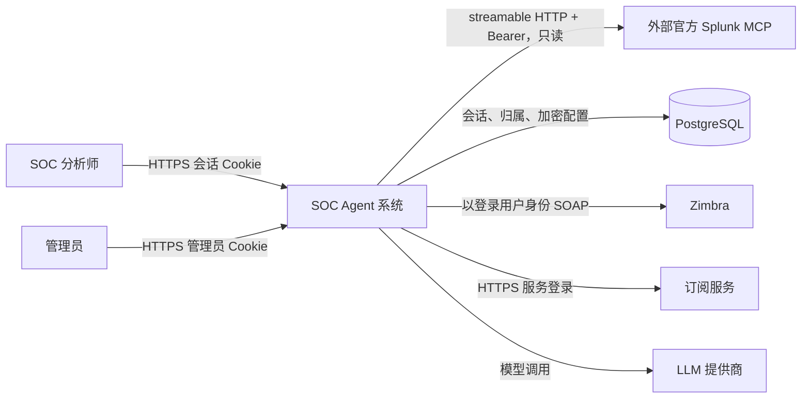
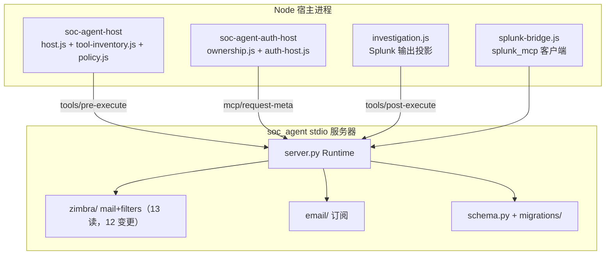

# 架构（中文版）

> **核对基准:** 提交 `56c8dd21492a5c36cb9f3eaa3da01160aba40033`（2026-09-12T07:22:44Z）· 文档核对日期 2026-09-12。
> 语言 / Language: **中文** · [English](../ARCHITECTURE.md)

**本页读者:** 需要了解系统真实形态 — 进程、边界、归属、扩展点 — 的开发者与架构师。

**读完后你将了解:** 系统的四个层级（上下文 → 容器 → 组件 → 代码地图），每条进程与信任边界的位置，vendored harness 如何被打补丁，以及数据跨越每条边界时发生了什么。

**通俗概述。** 一个 Node 进程在内置 harness 上向浏览器提供 UI 并承载 SOC 产品插件。浏览器侧拆成强制核心、隔离侧栏/工作区，以及五个可独立选择的功能插件；官方侧栏/工作区插件被禁用，但其源码保持冻结。它把 Python MCP 服务器作为 stdio 子进程拉起（`soc_agent`），可选地作为客户端连到外部官方 Splunk MCP 服务器（`splunk_mcp`），经该 Python 子进程以 SOAP 访问 Zimbra、以 HTTPS 访问订阅服务，并把身份/归属/配置持久化到 PostgreSQL。模型的每一次工具调用都要过两道过滤 — harness 注册表与 SOC 宿主策略 — 变更类操作还需人工审批。

**前置要求:** [PRODUCT_OVERVIEW.md](PRODUCT_OVERVIEW.md)；术语见 [reference/GLOSSARY.md](reference/GLOSSARY.md)。

---

## 1. 系统上下文

系统上下文图（可交互版本见英文站 [site/index.html](../site/index.html)；可编辑源: [diagrams/system-context.mmd](../diagrams/system-context.mmd)）：

| 参与方 / 系统 | 关系 | 信任 |
|---|---|---|
| SOC 分析师 | 浏览器 → HTTPS（默认端口 3080），会话 Cookie `soc_session` | 已认证用户 |
| 管理员 | 浏览器 → `/admin`，Cookie `soc_admin_session` | 管理员（特权 API 访问） |
| SOC Agent 系统 | 下文所述 Node 宿主 + 子进程 | 可信核心 |
| Zimbra | SOAP（`ZIMBRA_HOST`）；身份 = 登录用户的会话令牌 | 外部，按用户凭据 |
| 外部官方 Splunk MCP 服务器 | streamable HTTP + Bearer 令牌；**本仓库是客户端** | 外部，服务凭据；自带防护 |
| 订阅服务 | HTTPS REST + 表单登录 | 外部，服务凭据 |
| PostgreSQL | `APP_POSTGRES_URI`（回退 `LANGGRAPH_POSTGRES_URI` → `POSTGRES_URI`） | 可信存储 |
| LLM 提供商 | 运行时经管理控制台配置（凭据只写） | 外部 |

## 2. 容器与进程边界

| 进程 | 是什么 | 由谁启动 | 通信对象 |
|---|---|---|---|
| **Node 宿主**（单进程） | vendored harness web 运行时 + cordis 插件 | `pnpm dsh web --no-open` | 浏览器（HTTP/WS）、PostgreSQL（`pg` 连接池）、Python 子进程、外部 Splunk MCP |
| **`soc_agent` Python 服务器** | FastMCP stdio 服务器，28 个工具 | `dsh-mcp-client` 按 `cordis.patch.yml`（`uv run unified-mcp-server`，`failOnStartupError: true`） | Zimbra SOAP、订阅 REST、PostgreSQL |
| **控制服务器**（`unified_mcp_server.control_server`） | 认证操作的常驻 JSON 行通道 | `ownership.js startControlChannel`（`SOC_CONTROL_CHANNEL=off` 时改为一次性 `auth_cli`） | PostgreSQL、Zimbra（发送） |
| **管理 CLI 子进程**（`unified_mcp_server.admin_cli`） | 每个管理操作一次性运行 | `host.js runAdmin` → `python-command.js` | 订阅服务（测试）、PostgreSQL（migrate） |
| **schema 迁移子进程**（`unified_mcp_server.schema migrate`） | 应用 SQL 迁移（URI 经 stdin 传入） | `ownership.js ensureSchema` / 管理 `migrate` RPC | PostgreSQL |
| **浏览器** | harness web 运行时 + 八个 SOC 浏览器 bundle（经 `window.__ModuleLoader__` 加载的闭包工厂：核心、隔离侧栏/工作区、五个可选功能包） | — | 仅 Node 宿主 |

网络边界：浏览器↔宿主（HTTP/WS、Cookie），宿主↔Splunk MCP（出站 HTTPS），Python↔Zimbra/订阅（出站），其余都是本机 IPC（stdio 管道）或回环数据库。进程边界要点：Python 子进程永远收不到 `SOC_ADMIN_*` 环境变量（`python-command.js`、`env_loader.py` 三处剔除）；控制通道是私有父子管道，其授权依据是每个载荷中的 `session_id`。

**为什么不能把 `soc_agent` 与 `splunk_mcp` 合并成一个框：** 前者是本地实现的服务器，*以登录用户身份*执行；后者是*以服务凭据*对外部端点执行的客户端桥接。两者的身份来源、失败模式（拉起失败 vs 连接失败）和防护（本地策略 vs 远端服务器）都不同。

## 3. 组件

完整 11 字段描述见 [reference/COMPONENT_CATALOG.md](reference/COMPONENT_CATALOG.md)。

依赖要点：

- **`tool-inventory.js` 是词汇表**：一个与运行时无关的模块导出全部工具名；`policy.js` 从它派生策略集合，桥接从它导入原始名。Python 的 28 个注册工具通过测试与之对齐（`policy.test.js`、`skills.test.js`、`splunk-bridge.test.js`、`test_server_tools.py`）— 漂移现在会导致导入失败或测试失败，而不是仅靠评审发现。
- **`ownership.js` 是最大的第一方模块**（本轮精简后仍是）：既是认证服务，也是把 harness 自身 API 变得按用户安全的受限 API 代理。数据库 DDL 已全部移入 Python 迁移。
- **harness 是被配置的，不是被分叉的**：`cordis.patch.yml` 切换上游插件行并插入 SOC 插件；唯一的文件级 vendor 补丁是 `patches/dsh-auto-collapse@0.1.4.patch`（本地化 + `data-dshcf-preserve` 豁免，用于草稿卡片）。

## 4. 代码地图

| 层 | 权威源码 | 生成产物 | 测试 |
|---|---|---|---|
| Node 插件 | `apps/soc-agent/*.js`（含 `tool-inventory.js`、`python-command.js`） | — | `tests/*.test.js`（41） |
| 装配 | `apps/soc-agent/cordis.patch.yml`、`package.json` | — | `skills.test.js`（补丁断言） |
| Python 服务器 | `server/unified_mcp_server/**`（活跃：`server.py`、`config.py`、`auth.py`、`request_context.py`、`schema.py`、`migrations/`、`postgres_store.py`、`errors/responses`、`blocking_io`、`env_loader`、`zimbra/**`、`email/`、`attachment_converter.py`、`control_server.py`、`admin_cli.py`、`auth_cli.py`） | — | 48 个测试 |
| 已移除 | Python Splunk 栈（`splunk/**`、`splunk_service.py`、`detection.py`）及其 12 个测试文件 | — | — |
| 浏览器包 | `packages/soc-agent-*/src/**` | `packages/soc-agent-*/lib/*`（**被跟踪**） | 各包测试 + 浏览器 smoke/screenshot |
| 技能 | `skills/*/SKILL.md` | — | `skills.test.js` 内容断言 |
| Vendor | `vendor/deepseek-harness/**`（`0.1.1-rc.2`；外层仓库是其工作区成员） | harness 构建产物（未跟踪） | 上游 |

逐文件索引: [reference/SOURCE_INDEX.md](reference/SOURCE_INDEX.md)。

## 5. 信任边界与门（摘要）

1. **浏览器 → 宿主：** 会话 Cookie；认证路由的同站/Origin 校验；`installTransport` 圈起的私有路由与 WS 升级；特权 API 仅管理员。
2. **Harness → 工具：** 注册表级限制（`agent/created`，尽力而为）+ 权威的 `tools/pre-execute` 精确名允许列表。
3. **宿主 → MCP：** 每服务器原始允许列表；每次调用元数据；185 秒超时。
4. **Python → 身份：** `soc_session_id` → Postgres 会话 → 用户本人的 Zimbra 令牌；拒绝 `account_id` 选择；180 秒操作预算。
5. **输出 → 模型：** Splunk 投影（PII 掩码、50 KB）、背景 64 KiB 上限、附件限额。
6. **变更 → 人：** 动作状态 + 审批瀑布；邮件额外需要界面确认。
7. **补丁级：** 模型可见的 shell/文件系统/子代理工具族整体禁用。
8. **配置级：** 官方 Splunk MCP 连接为必配 — setup 与 `--check` 缺失即失败，配置错误会大声失败而不是悄悄失去 Splunk 工具。

完整威胁视角: [SECURITY_AND_TRUST_BOUNDARIES.md](SECURITY_AND_TRUST_BOUNDARIES.md)。

## 6. 一段话数据流

分析师输入成为 harness 的一次 agent 回合；模型可能调用允许列表内的工具；宿主策略门校验名称 + 模式 + 每工具状态（需要时向人请求审批）；调用带着会话元数据跨过进程边界；Python 服务器从 Postgres 解析身份，在 180 秒预算内对 Zimbra/订阅执行，并返回 `ok/error` 信封；`splunk_mcp` 的结果在进入模型上下文前先经投影脱敏限幅；界面通过 toolview 渲染结果（草稿卡片是人在回路中的特例）；持久事实（设置、归属、会话）在 PostgreSQL；会话工件在用户工作区与 harness 状态目录。

## 7. 扩展点

- **加工具：** Python `register_tools` 模块 + `cordis.patch.yml` 原始允许列表 + `tool-inventory.js` 清单 + 客户端标签（如需）+ 双端测试。清单: [DEVELOPMENT.md](DEVELOPMENT.md)。
- **加技能：** 一个 `skills/<name>/SKILL.md` — `skill-filesystem` 重启后自动发现，无需注册。
- **改 harness 行为：** 编辑 `cordis.patch.yml` 行（启用/禁用/配置）— 绝不改 vendor 源码；vendor 变更须经 `patches/` + profile 补丁副本保持可复现（`setup.sh`）。
- **预设：** `vendor/.../agent-presets/citic-soc/agent.cordis.yml`（人格、指令候选、压缩阈值）— vendor 内的本地配置，被 `skills.test.js` 断言。

## 仓库中的证据

- 装配: `apps/soc-agent/cordis.patch.yml`（权威插件名册）、`package.json` 导出
- 进程: `vendor/deepseek-harness/packages/mcp/mcp-client/src/transport.ts`（拉起/HTTP）、`ownership.js startControlChannel`、`host.js runAdmin`、`schema.py main`
- 边界: `ownership.js installTransport/createScopedApiProxy`、`host.js tools/pre-execute`、`server.py fresh_runtime/execute`
- 图: `docs/diagrams/*.mmd`（可编辑源）

## 假设与未知

- harness 内部行为（重连退避、压缩）只写到集成所需的深度；上游内部不在范围内。
- 单机 + 外部服务之外的部署拓扑（如反向代理、集群）在本仓库未配置，状态未知。
