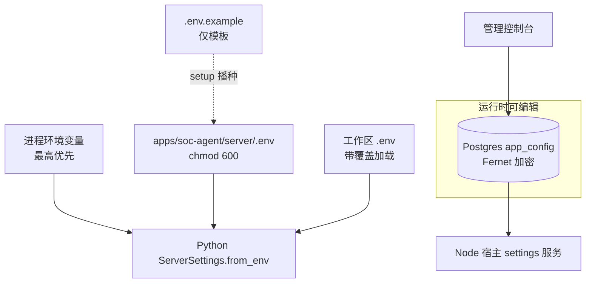

# 配置（中文版）

> **核对基准:** 提交 `56c8dd21492a5c36cb9f3eaa3da01160aba40033`（2026-09-12T07:22:44Z）· 文档核对日期 2026-09-12。
> 语言 / Language: **中文** · [English](../CONFIGURATION.md)。逐变量参考: [reference/CONFIGURATION_REFERENCE.md](../reference/CONFIGURATION_REFERENCE.md)。

**本页读者:** 部署或重配系统的运维、追踪取值来源的开发者。

**读完后你将了解:** 配置源及其精确优先级、必填与可选项、机密的安全供给方式、加密值的工作方式、按服务配置、默认行为，以及一次配置变更需要什么（重启 vs 重建）。

**通俗概述。** 一切配置都归部署所有：Python 服务器只读环境变量（由 setup doctor 写入 `apps/soc-agent/server/.env`），Node 宿主读取自己的环境变量加同一文件，管理控制台只能改少数存在 PostgreSQL（加密）中的运行时设置。任何会削弱安全性的东西都不能从浏览器配置。

**前置要求:** [GETTING_STARTED.md](GETTING_STARTED.md) §3。

---

## 1. 来源与优先级

可编辑源: [diagrams/configuration-precedence.mmd](../diagrams/configuration-precedence.mmd)。

- **Python:** 按设计只用环境变量（"never from the database or a browser-editable document"，`config.py`）；`env_loader.load_server_env` 先读 `server/.env` 再读工作区 `.env`（**带覆盖**）；先于加载设置的环境变量仍然最高。
- **Node 桥接:** `splunk-bridge.js` 先读 `process.env` 再读 `server/.env`。
- **Node 认证:** `resolveApplicationStorageUri` / `resolveAdminCredentials` 同序（环境 → `server/.env`）。
- **管理可编辑的运行时设置**（加密 `app_config`）: `soc-action-approval`、`soc-background`、`soc-agent-markitdown-attachments`、`time-context`、`llm-pi-ai` + 凭据引用。这些绝不包含服务端点 — 控制台明说 "Service configuration is managed by the server environment."
- **代码中的回退链:** 存储 `APP_POSTGRES_URI` → `LANGGRAPH_POSTGRES_URI` → `POSTGRES_URI`；服务器根 `DSH_SOC_AGENT_SERVER` → `<bundle>/server`；工作区根 `MCP_SERVER_ROOT` → 遗留拼写 `MCP_SEVER_ROOT`；Docker 选择器随本轮删除（`RUNNING_INSIDE_DOCKER`/`SPLUNK_HOST_FOR_DOCKER` 不再存在）。

## 2. 必填 vs 可选

| 条件 | 必填 |
|---|---|
| 任何部署 | `SOC_ADMIN_EMAIL`、`SOC_ADMIN_PASSWORD`（宿主缺之不启动） |
| 登录/归属 | `APP_POSTGRES_URI`（链之一）+ `APP_SETTINGS_ENCRYPTION_KEY` |
| Zimbra 功能 | `ZIMBRA_HOST`（`configured = bool(host)`） |
| Splunk 桥接 | `SPLUNK_MCP_ENDPOINT` **和** `SPLUNK_TOKEN` — setup 与 `--check` 直接要求，二者缺一桥接保持关闭 |
| 订阅工具 | `SUBSCRIPTION_SERVER_URL` + `SUBSCRIPTION_SERVER_USER` + `SUBSCRIPTION_SERVER_PASSWORD` |
| LLM 转换（MarkItDown OCR/LLM） | `MARKITDOWN_LLM_ENABLED=true` ⇒ `MARKITDOWN_LLM_API_KEY` + `MARKITDOWN_LLM_MODEL` |
| 其余 | 可选，默认值安全（超时、限额、TLS 校验开启） |

## 3. 机密的安全供给

- 机密**只**进 chmod 600 的 `.env` 文件，经 setup 提示输入（`read -rs`，不回显）或直接编辑文件。绝不进 shell 命令（历史）、工单、聊天或本文档。
- setup doctor 在留空时自动生成 `APP_SETTINGS_ENCRYPTION_KEY`（openssl，`/dev/urandom` 兜底）。
- `SOC_ADMIN_EMAIL`/`SOC_ADMIN_PASSWORD` **仅属 Node**：从 Python 子进程环境剔除（三处：`python-command.js`、`env_loader.py`）。它们保护管理控制台，不应复用于别处。
- 加密密钥与数据库必须**一起**备份（见 [DATA_AND_PERSISTENCE.md](DATA_AND_PERSISTENCE.md) §6）。
- 校验失败关闭且不回显：端点拒绝内嵌凭据/查询/片段/明文 HTTP（除非对应 `*_ALLOW_INSECURE_HTTP`）；携带凭据的 Splunk/Zimbra 端点形状被拒绝（`test_config.py`）；状态输出脱敏（`redact_endpoint`）。

## 4. 加密值

`app_config` 与存储的令牌使用 Fernet。合法 Fernet 密钥原样使用；其他输入经 SHA-256 派生为密钥（代码中有注释）。后果：轮换密钥会使既有加密行不可解密（运行时显式报错并给出修复指引，不会静默损坏或静默可读）；提供商密钥在相同存储之上再套只写 credentials API。

## 5. 按服务配置要点

| 服务 | 要点 |
|---|---|
| Splunk（桥接） | **必配**；仅五变量（endpoint/token/verify/insecure/sanitize）；185 秒超时固定在桥接内 |
| Splunk（遗留配置） | *本轮已移除* — REST/策略/查找/队列变量族全部删除；`SplunkSettings` 只剩五个桥接字段，`public_status` 报告 `official_mcp_enabled` |
| Zimbra | 主机 + TLS + 超时 + 七个变更门（`ZIMBRA_ALLOW_*`）+ 附件限额；遗留 `ZIMBRA_EMAIL/PASSWORD` 与账户文件变量已从模板与代码中移除 |
| 订阅 | URL/用户/密码/超时/明文选择；重定向策略硬编码（≤5、同主机、不降级） |
| MarkItDown | 可选 LLM/OCR（key+model）；内建转换始终可用 |
| Harness | `vendor/deepseek-harness/.env` 只接收 setup 写入的 Postgres URI + 加密密钥 |
| Schema 迁移 | 不走环境 — `schema migrate` 从 stdin 接收 URI（防止误初始化别的库） |

## 6. 重启 / 重建影响

| 变更 | 需要 |
|---|---|
| `.env` 值（任一文件） | 宿主重启（启动时读取环境）；Python 子进程随宿主重启 |
| 管理控制台设置（`app_config`） | 无 — 实时生效（`applies: 'live'`）；会话动作模式覆盖立即生效 |
| 客户端源码变更 | `pnpm --filter dsh-soc-agent-client run build`（被跟踪的 `lib/`）+ 浏览器刷新 |
| 技能文件变更 | 新会话（技能按会话加载）— 下次会话验证 |
| `cordis.patch.yml` 变更 | 宿主重启；涉及 profile 装配时跑 `./setup.sh --plugins` |
| Harness/vendor 变更 | `./setup.sh --plugins`（指纹门控重建）或 `--rebuild` |

## 仓库中的证据

- `unified_mcp_server/config.py`（`from_env`、env-only 注释、校验、`public_status` 脱敏）、`env_loader.py`
- `apps/soc-agent/splunk-bridge.js`（`resolveOfficialSplunkConfig`、URL 校验）、`ownership.js`（`resolveAdminCredentials`、`resolveApplicationStorageUri`、`ensureSchema` → schema migrate）、`setup.sh`（`collect_parameters` 优先级链）
- `apps/soc-agent/server/.env.example`（完整安全模板）

## 未知项

- 反向代理头处理（`x-forwarded-proto`）取决于部署。
- 被移除的 Docker 相关变量意味着容器部署定义在仓库之外。
