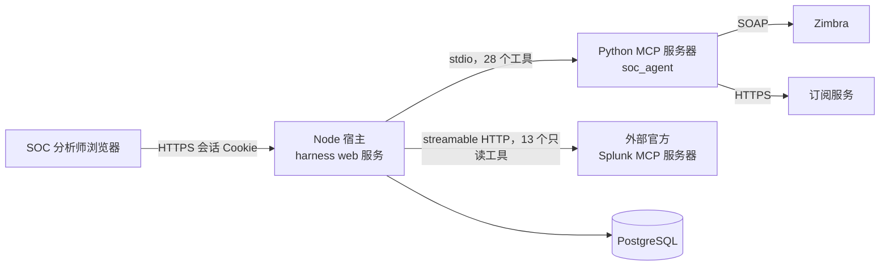

# CITIC_AGENT 文档（中文版）

> **核对基准:** 提交 `56c8dd21492a5c36cb9f3eaa3da01160aba40033`（分支 `splunk-offical-mcp`，提交于 2026-09-12T07:22:44Z）· 文档核对日期 2026-09-12。
> 每条论断均以仓库路径与符号名作为证据，详见 [reference/TRACEABILITY_MATRIX.md](../reference/TRACEABILITY_MATRIX.md)（英文）与本套中文内容一一对应。
> 语言 / Language: **中文** · [English](../README.md)

**本页读者:** 所有人。本页是整套中文文档的入口与阅读地图。

**读完后你将了解:** CITIC SOC Agent 是什么、哪个页面回答哪个问题，以及系统最精炼的整体图景。

**通俗概述。** CITIC SOC Agent 是一个自包含、基于浏览器的安全运营（SOC）助理。SOC 分析师用本人的 Zimbra（邮箱）身份登录，与一个严格受控的 AI 智能体（"Sentinel"）对话；智能体只能通过一组明确允许的只读工具调查 Splunk、读取该分析师本人的邮箱。智能体可以起草邮件，但只有人在界面上点击"发送"才会真正投递。所有工具调用都经过服务端策略校验；变更类操作需要人工审批；Splunk 访问只读。系统运行在内置（vendored）的 DeepSeek Harness 之上，外加一个 Python MCP 服务器（Zimbra + 邮件订阅工具）、一个连接外部官方 Splunk MCP 端点的客户端桥接、认证/归属权层，以及设置/管理界面。

**前置要求:** 无。

---

## 一屏系统摘要

| 问题 | 回答 |
|---|---|
| 这是什么？ | 一个带工具调用 AI 的网页版安全运营调查助手，部署为一个 Node 宿主进程加若干 Python 子进程。 |
| 谁在用？ | 通过认证的 SOC 人员（分析师），以及一位管理员（独立的静态管理员登录）。 |
| 主要外部系统 | Zimbra（邮件、身份）、外部官方 Splunk MCP 服务器、订阅服务、PostgreSQL。 |
| 两个 MCP 服务器 | `soc_agent` — 本地 Python stdio 服务器，仅提供 Zimbra + 订阅工具。`splunk_mcp` — 连接外部官方 Splunk MCP 端点的客户端桥接，按允许列表只读。 |
| 安全模型 | 仅允许列表内工具；默认只读；每工具 ask/auto-run/disabled 三态；Full access 与 SOC mode 两种模式；邮件投递必须经界面显式 Send 确认；Harness 的 shell/文件系统工具被禁用。 |
| 持久化 | PostgreSQL（会话、归属权、加密配置）、`.data/soc-workspaces/` 下按用户隔离的工作区、（已随 Splunk 栈删除的）SQLite 证据存储、纳入版本管理的 `lib/` 生成产物。 |

## 最精简架构图

可编辑源文件: [../diagrams/system-context.mmd](../diagrams/system-context.mmd)。完整架构: [ARCHITECTURE.md](ARCHITECTURE.md)。

## 阅读地图 — 四条快速路径

| 你是… | 阅读顺序 | 用时 |
|---|---|---|
| **新产品了解者** | [PRODUCT_OVERVIEW.md](PRODUCT_OVERVIEW.md) → [ARCHITECTURE.md](ARCHITECTURE.md)（context 层）→ [USER_INTERFACE_AND_ACTION_MODES.md](USER_INTERFACE_AND_ACTION_MODES.md) | 约 10 分钟 |
| **开发者** | [GETTING_STARTED.md](GETTING_STARTED.md) → [DEVELOPMENT.md](DEVELOPMENT.md) → [MCP_AND_TOOL_ROUTING.md](MCP_AND_TOOL_ROUTING.md) → [TESTING.md](TESTING.md) → [reference/SOURCE_INDEX.md](reference/SOURCE_INDEX.md) | — |
| **运维 / 管理员** | [GETTING_STARTED.md](GETTING_STARTED.md) → [DEPLOYMENT_AND_OPERATIONS.md](DEPLOYMENT_AND_OPERATIONS.md) → [CONFIGURATION.md](CONFIGURATION.md) → [TROUBLESHOOTING.md](TROUBLESHOOTING.md) → [reference/CONFIGURATION_REFERENCE.md](reference/CONFIGURATION_REFERENCE.md) | — |
| **安全评审者** | [SECURITY_AND_TRUST_BOUNDARIES.md](SECURITY_AND_TRUST_BOUNDARIES.md) → [AUTHENTICATION_AND_OWNERSHIP.md](AUTHENTICATION_AND_OWNERSHIP.md) → [MCP_AND_TOOL_ROUTING.md](MCP_AND_TOOL_ROUTING.md) → [DATA_AND_PERSISTENCE.md](DATA_AND_PERSISTENCE.md) → [reference/TRACEABILITY_MATRIX.md](reference/TRACEABILITY_MATRIX.md) | — |

## 全部页面索引

| 页面 | 回答的问题 |
|---|---|
| [GETTING_STARTED.md](GETTING_STARTED.md) | 前置要求、安全安装、首次验证、首启常见故障 |
| [PRODUCT_OVERVIEW.md](PRODUCT_OVERVIEW.md) | 业务问题、用户、工作流、非目标、术语 |
| [ARCHITECTURE.md](ARCHITECTURE.md) | 上下文、容器、组件、代码地图、vendor 接缝 |
| [RUNTIME_FLOWS.md](RUNTIME_FLOWS.md) | 端到端流程：登录、Splunk 查询、Zimbra 读取、草稿/发送、订阅、设置变更、附件 |
| [MCP_AND_TOOL_ROUTING.md](MCP_AND_TOOL_ROUTING.md) | 工具名、命名空间、允许列表、策略、命名陷阱 |
| [AUTHENTICATION_AND_OWNERSHIP.md](AUTHENTICATION_AND_OWNERSHIP.md) | 登录、会话、身份传播、归属权、管理员认证 |
| [SECURITY_AND_TRUST_BOUNDARIES.md](SECURITY_AND_TRUST_BOUNDARIES.md) | 威胁视角下的所有控制与残余风险 |
| [DATA_AND_PERSISTENCE.md](DATA_AND_PERSISTENCE.md) | 存储结构、Schema、加密、保留、数据归属 |
| [USER_INTERFACE_AND_ACTION_MODES.md](USER_INTERFACE_AND_ACTION_MODES.md) | 界面区域、Full access vs SOC mode、每工具状态、草稿 Send |
| [SOC_CLIENT_PLUGINS.md](SOC_CLIENT_PLUGINS.md) | 隔离 sidebar/workspace 架构、必需 core、可选 feature 插件、setup、snapshot 与回滚 |
| [CONFIGURATION.md](CONFIGURATION.md) | 配置来源、优先级、机密、校验 |
| [DEVELOPMENT.md](DEVELOPMENT.md) | 布局、工具链、构建、补丁、变更清单 |
| [TESTING.md](TESTING.md) | 测试分层、运行方式、覆盖地图、缺口 |
| [DEPLOYMENT_AND_OPERATIONS.md](DEPLOYMENT_AND_OPERATIONS.md) | setup doctor、更新流程、健康检查、运维 |
| [TROUBLESHOOTING.md](TROUBLESHOOTING.md) | 症状 → 诊断 → 处置，按领域组织 |
| [DOCUMENTATION_AUDIT.md](DOCUMENTATION_AUDIT.md) | 核对记录、矛盾、未知项 |
| [reference/](reference/REPOSITORY_MAP.md) | 仓库地图、组件目录、源码索引、接口目录、MCP 工具目录、配置参考、数据存储目录、测试覆盖矩阵、可追溯矩阵、术语表 |
| [diagrams/](../diagrams/README.md) | 每张图的可编辑 Mermaid 源文件 |
| [SHORTENING_PLAN_IMPLEMENTATION.md](SHORTENING_PLAN_IMPLEMENTATION.md) | 维护者关于移除 Splunk 栈重构的实施报告（基线 `d264ca7`） |

## 仓库中的证据

- 产品定义与装配：`apps/soc-agent/cordis.patch.yml`、`apps/soc-agent/package.json`、根目录 `README.md`。
- 工具面：`apps/soc-agent/tool-inventory.js`、`policy.js`、`splunk-bridge.js`、`apps/soc-agent/server/unified_mcp_server/server.py`。
- 身份与归属权：`apps/soc-agent/auth-host.js`、`ownership.js`、`apps/soc-agent/server/unified_mcp_server/postgres_store.py`。
- 治理政策（改动行为前必读）：根目录 `AGENTS.md`。

## 运维警告

本文档描述的是一个在用的安全系统。`docs/` 中的任何内容都不授权对 Splunk、Zimbra 或订阅服务执行运维操作。调查默认只读；变更必须走文档规定的审批流程。参见 [SECURITY_AND_TRUST_BOUNDARIES.md](SECURITY_AND_TRUST_BOUNDARIES.md)。
