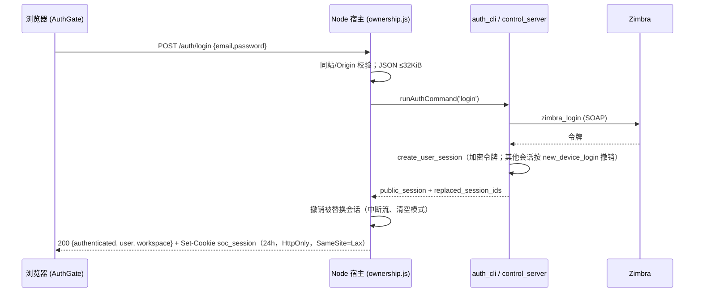
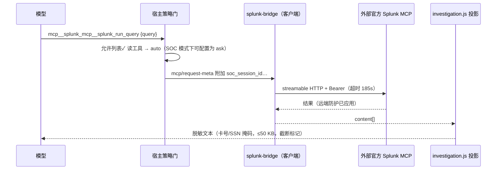
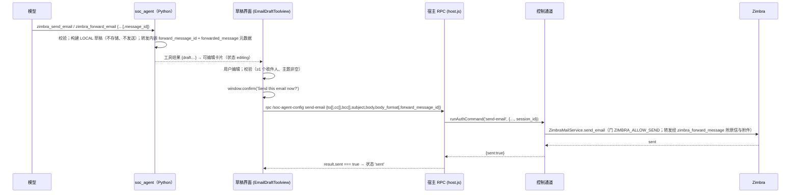

# 运行时流程（中文版）

> **核对基准:** 提交 `56c8dd21492a5c36cb9f3eaa3da01160aba40033`（2026-09-12T07:22:44Z）· 文档核对日期 2026-09-12。
> 语言 / Language: **中文** · [English](../RUNTIME_FLOWS.md)

**本页读者:** 需要知道"用户做 X"到"系统响应"之间确切发生了什么（含失败分支）的开发者与评审者。

**读完后你将了解:** 十五条端到端追踪 — 安装、启动、登录、归属权、工具允许列表、Splunk 读取、Zimbra 读取、草稿/发送、订阅、动作模式、管理设置、附件、技能、输出投影、错误处理 — 每条都含触发、参与方、授权、存储、外部调用、成功与失败行为。

**通俗概述。** 每个流程都经过同样四道检查点：浏览器（仅便利）、受限宿主边界（会话/归属）、工具策略门（允许列表 + 模式 + 每工具状态 + 审批）、Python/外部边界（身份 + 预算 + 上游门控）。理解这四道门，所有流程都可预测。

**前置要求:** [ARCHITECTURE.md](ARCHITECTURE.md)；工具名见 [reference/MCP_TOOL_CATALOG.md](reference/MCP_TOOL_CATALOG.md)。

---

## 1. 安装 / 引导与更新生命周期

**触发:** 运维执行 `./setup.sh`（或 bootstrap 副本）/ `./update.sh`。
**路径:** 前置检查（node/pnpm/uv）→ 参数收集（环境优先级；机密 `read -rs`）→ 写 `apps/soc-agent/server/.env` + `vendor/deepseek-harness/.env`（chmod 600）→ `uv sync --python 3.12` → 指纹门控的 `pnpm install --frozen-lockfile` + 构建（指纹在 `.data/harness-*.sha256`；`--rebuild` 强制）→ profile 补丁副本 + 插件安装/清理（受管集合包含 app、强制核心、隔离侧栏/工作区和五个可选 SOC 浏览器包）→ SOC bundle 注册 + 解析校验 → 摘要（掩码值；不启动服务）。
**失败:** 前置缺失（循环或记录警告）；脏树阻止分支切换（从不 stash）；任一 SOC 浏览器 bundle 漂移触发重建；`--check` 汇总失败计数后 exit 1。官方 Splunk MCP 端点 + 令牌现为**必填**。
**证据:** `setup.sh` 各阶段；`update.sh`（干净树 ff-only + `--plugins`）。

## 2. 开发构建与应用启动

**触发:** `pnpm dsh web --no-open`。
**路径:** harness 加载 web profile → cordis loader 应用 `cordis.patch.yml`（禁用官方侧栏/工作区与编码工具、启用技能/计划/问询、插入隔离 SOC 表面与选中的功能包）→ 插件 `apply(ctx)`：auth-host（路由、传输圈栏、Postgres 连接池）、host（RPC、钩子、管理页、背景刷新）、强制 SOC client core（认证遮罩、runtime service、admin 回退）、隔离侧栏/工作区、可选功能包、桥接（配置齐全时连接 `splunk_mcp`；否则日志禁用）、`soc-agent-mcp`（拉起 `uv run unified-mcp-server`；迁移在启动时应用；`load_server_env` 读取 `.env`）→ web 服务监听 3080。
**失败:** Python 拉起失败是致命的（`failOnStartupError: true`）；桥接配置缺失只禁用桥接；缺 `SOC_ADMIN_EMAIL/PASSWORD` 在 auth 插件构造时抛错；Postgres 不可达 → 存储退化为空操作，下游登录失败关闭。
**证据:** `cordis.patch.yml`；`ownership.js` 构造器；`splunk-bridge.js apply`。

## 3. 浏览器认证与身份传播

**身份权威:** Postgres 行 — 之后每个请求把 `soc_session_id` 解析为 `soc_app_sessions` → 用户的 Zimbra 令牌（`identity_for_session`）。**失败:** 凭据无效 → 一律 401 `invalid email or password`（密码永不回显；Python 返回畸形载荷 → Node 删除已创建会话）；过期 → 401 + 惰性删行；对话中上游 Zimbra 令牌失效 → `zimbra_auth_error` 删除应用会话（`server.py execute`），强制重新登录；跨站登录 → 403。
**单设备策略:** 新登录替换旧会话；旧设备通过一次性 `soc_session_revocations` 行得知原因（`SESSION_REPLACED_MESSAGE`）。
**证据:** `ownership.js handleAuthRoute`、`auth_cli.py login`、`postgres_store.py create_user_session`；测试 `auth.test.js`、`test_auth.py`。

## 4. 会话、工作区与设置的归属检查

浏览器的每个 API 调用都经过 `createScopedApiProxy`：九个域（`sessions`、`subagents`、`workspace`、`folders`、`events`、`downloads`、`skills`、`agentPresets`、`goals`）被包装为 (a) 授权阶段拒绝跨用户 id（11 个变更方法有测试）；(b) 规范化 — `sessions.create` 由**服务端生成** `session-<uuid>` id（防客户端占位）并默认指向用户的 General 工作区；(c) 列表/读取结果的 Postprocess 过滤；(d) `respond` 守卫 — 审批答复只能落在本用户挂起的请求上（否则 `{accepted:false, reason:'not-pending'}`）。`dsh-soc-agent-workspace` 在自己生命周期内使 client-side `api.folders` 不可用，并在 teardown 恢复原值。工作区路径必须是单个目录名并解析在 `MCP_SERVER_ROOT/.data/soc-workspaces/<userId>/` 之下（`realpath` 规范化 + 包含性校验；穿越 → `workspace-invalid-path`）。General 工作区不可改名/删除（`workspace-protected`）。
**证据:** `ownership.js createScopedApiProxy`、`userWorkspaceRoot`、`isWithinPath`；`auth.test.js` IDOR 测试。

## 5. MCP 服务器发现与工具允许列表

三层按序：(1) **注册** — `dsh-mcp-client` 只注册原始 `allowedToolNames` 中的名字（`soc_agent` 28 个；`splunk_mcp` 13 个），全部源自 `tool-inventory.js`；(2) **限制** — `agent/created` 时宿主尽力把 agent 工具集限制为 `DOMAIN_TOOLS ∪ CONTROL_TOOLS`；(3) **执行** — `tools/pre-execute`（全局）拒绝该并集之外的任何名字，再应用模式/状态逻辑。迟到的 MCP 工具由第 3 层兜底（代码注释原话）。测试钉住三层与精确计数（30/42/12）。
**证据:** `cordis.patch.yml`、`tool-inventory.js`、`host.js apply` + `savedActionPolicy`、`policy.test.js`、`mcp-discovery.test.js`。

## 6. 经 `splunk_mcp` 的一次只读 Splunk 请求

**身份:** 桥接的服务令牌，不是用户的。**失败分支:** 桥接未配置 → 工具根本不注册（第 1/3 层拒绝；setup/`--check` 也会失败）；连接错误/超时 → 工具错误；结果超 50 KB → 带显式标记截断；`SPLUNK_SANITIZE_OUTPUT=0|false|no|off` 关闭掩码（已记录的退出项）。
**证据:** `splunk-bridge.js`、`investigation.js`、`investigation.test.js`、`splunk-bridge.test.js`。

## 7. 经 `soc_agent` 的一次 Zimbra 读取

以 `zimbra_search_emails` 为例：元数据（`soc_session_id`）到达 → `fresh_runtime` 从 Postgres 解析身份（缺失 → `authentication_required`；未知/过期 → `session_expired`）→ `operation_budget` 开启（min 180 秒 / `soc_deadline_ms`）→ 身份绑定的 `ZimbraMailService`（LRU 32）在**联网前**校验查询 → 用用户令牌发起 SOAP → 结果经 `responses.success` 整形 → 记录关联 id（`mcp_call ok/failed`）。
**失败:** `query_validation_error`（联网前）、`zimbra_auth_error`（删除应用会话 → 重新登录）、`zimbra_tls_error`、`zimbra_connection_error`（可重试）、一律 `internal_error`（上游文本不外泄 — 第三方消息可能含凭据/URL）。
**证据:** `server.py fresh_runtime/execute`、`zimbra.py soap_request`、`test_zimbra_service.py`。

## 8. 邮件草稿 → 审阅 → 显式发送

**状态机:** `editing → sending → sent | failed | discarded`（discarded 可 Reopen；失败后按钮变 Retry）。**确认是界面级控制**: 服务端强制认证（`requireUser`）、会话身份、`ZIMBRA_ALLOW_SEND` 门，并要求 Zimbra 的成功回执才报告 `sent`；没有服务端确认令牌。传输后丢响应以 `operation_outcome_unknown` 呈现 — "请先核实结果再试" — 且绝不重放。不存在模型可调用的发信工具。
**证据:** `EmailDraftToolview.tsx`、`host.js send-email`、`auth_cli.py send-email`、`zimbra_service.py send_email`；`email-draft-toolview.test.ts`、`test_zimbra_service.py`、`control-channel.test.js`。

## 9. 订阅读取、预览与变更

读（`list_subscriptions`、`get_subscription_schema`、`preview_subscription`）默认自动执行。预览对外部 API 做干跑（`POST /api/subscriptions/preview`；mode `create|update`；update 必须带 email）。变更（`create/update/delete_subscription`）在 `ACTION_CATALOG` → 默认 `ask` → harness 审批流在执行前呈现给用户；Python 客户端再叠加校验（update 需 email、至少一个字段、team 非空）并对 URL 中的 email 做转义。客户端生命周期：每进程一次表单登录、401 时恰好一次重登、≤5 次同源重定向（不降级）、远端错误体不外泄。
**证据:** `email/service.py`、`email/tools.py`、`test_email_service.py`、`policy.js ACTION_CATALOG`。

## 10. Full access 与 SOC mode 的判定行为

每次工具调用：从设置 `soc-action-approval` 读取部署策略；若 `socAuth.actionMode(exec)` 有会话级覆盖则叠加；`full` → 一切域工具直接放行（连 `disabled` 也放行）；`soc` → 使用每工具状态，默认变更 `ask`、读取 `auto`。未知/非法设置退化为 SOC 默认（"绝不能因设置异常而放行"）。模式切换 UI 经 `set-action-mode` 写入（采纳服务端确认值；畸形响应失败关闭）。会话模式存于内存 Map，登出/撤销/重启即清空。
**证据:** `host.js savedActionPolicy` + `policyValue`、`ownership.js setActionMode`、`SocActionPolicyMenu.tsx` + `actionPolicy.ts`；`policy.test.js`、`user-mode.test.js`、`action-policy.test.ts`。

## 11. 管理设置、加密持久化、校验与脱敏

管理控制台 → RPC（`get-settings`、`test-splunk`、`test-subscription-server`、`migrate`）。`test-splunk` **通过桥接实时执行 `splunk_get_info`**（`testOfficialSplunkConnection` — 185 秒预算、错误消息中的 Bearer 令牌脱敏）；其余命令经 `python-command.js` 拉起一次性 Python 子进程（子环境**不含** `SOC_ADMIN_*`；185 秒超时 → SIGTERM）→ 解析 stdout JSON。`migrate` 应用 SQL 迁移（URI 经 stdin）。`get-settings` 只返回脱敏状态（端点主机经 `redact_endpoint`，布尔/限额；含 `official_mcp_enabled`；无密码/令牌/用户名/邮箱身份）。设置变更走 harness 设置 API + `expectedRevision`（乐观并发）写入 Fernet 加密的 `app_config`。提供商 API key 只写（`credentials.set`；`describe` 只返回 configured/writable 布尔）。校验/测试动作从不写配置 — `update-settings`/`delete-setting` 按设计拒绝。
**证据:** `host.js runAdmin/parseAdminFailure`、`python-command.js`、`admin_cli.py`、`config.py public_status`、`postgres_store.py` 加密、`schema.py`；`test_config.py`、`sections.test.ts`。

## 12. 附件获取、转换、展示与失败

两个入口：**邮箱**（`zimbra_get_attachment_text` → 有界下载 → 带 `ZIMBRA_MAX_*` 限额的 `AttachmentConverter`）与**上传**（客户端 base64 → 管理 RPC `convert-attachment` 带每请求限额；两个并发 worker 保序并缓存成功结果）。转换由 MarkItDown 全内存完成（`io.BytesIO`，无临时文件），含归档安全预检（成员 ≤1 000、展开 ≤50 MB、加密成员检测）、UTF-8/JSON/XML 校验、成功 LRU 缓存（64 项/4 MB）。输出带 `text_truncated`，界面加摘录提示。
**失败码:** `attachment_too_large`、`attachment_unsupported`、`attachment_encrypted`、`attachment_malformed`、`attachment_converter_unavailable`、`attachment_invalid_filename`、`attachment_conversion_failed`、`attachment_conversion_cancelled`；客户端限额错误在任何 RPC 之前以用户可读消息呈现。
**证据:** `attachment_converter.py`、`markitdownAttachments.ts`、`host.js validateAttachmentPayload`；`test_zimbra_service.py`、`markitdownAttachments.test.ts`。

## 13. 技能注入与工具授权

会话开始时 `citic-soc` 预设加载指令文件（候选 `AGENTS.md`、`CLAUDE.md`、`BACKGROUND.md`；64 KiB 上限），技能系统经 `skill-filesystem.customSkillDirs` 索引 `skills/`。模型看到技能摘要，并通过 **`skill`** 工具加载完整手册 — 该工具本身在 `READ_ONLY_TOOLS`（默认 auto）。`BACKGROUND.md` 另由宿主每 N 个持久用户提示（默认 5，可实时调整，0 关闭；64 KiB 渲染上限）作为插件消息重新注入。技能仅以指令约束行为 — 真正的约束仍是工具策略；`skill` 工具不授予任何额外工具访问。
**证据:** 预设 YAML、`host.js installBackgroundRefresh`、`policy.js`（`skill` 条目）；`background.test.js`、`skills.test.js`。

## 14. 调查输出投影

`tools/post-execute`（全局）只作用于 `mcp__splunk_mcp__splunk_*` 的文本块结果：合并 → 掩码卡号/SSN → 按 UTF-8 边界截断至 50 000 字节并附标记 `\n[official Splunk MCP output truncated by the SOC response limit]`。其他命名空间（含 `soc_agent`）原样通过，错误结果不投影。理由（代码注释）：官方 Splunk 结果绕过本地查询准入，因此这里是它们的输出边界。
**证据:** `investigation.js`；`investigation.test.js`。

## 15. 错误传播、超时与恢复

| 层 | 机制 | 用户所见 |
|---|---|---|
| MCP 调用 | 185 s 客户端超时；180 s 服务端操作预算（`operation_timeout`） | 工具错误卡片；智能体可改述 |
| Python 信封 | `ServiceError` → `{ok:false, error:{code,message,retryable,details}}`，经 `McpFailureEnvelope`（transport 标记 `isError`） | 模型可行动的结构化错误 |
| Python 意外异常 | 记录日志**不含**第三方文本；固定 `internal_error` 消息 | 通用失败，无凭据/URL 泄漏 |
| 管理子进程 | 185 s → SIGTERM；stderr JSON `{code,message,details}` 解析（≤400 字符、≤20 个缺失环境变量） | 带前缀的 RPC 错误 |
| 控制通道 | 传输后丢响应 → `operation_outcome_unknown`（不重放）；传输前失败 → 一次性 spawn 兜底 | "请先核实结果再试。" |
| 第一方代码中不存在重试 | — | 失败如实呈现；由智能体决定下一步 |

**证据:** `server.py execute`、`ownership.js` 通道守卫、`host.js` 错误映射；`test_control_server.py`、`control-channel.test.js`。

相关: [diagrams/](../diagrams/README.md)（认证时序、草稿发送、动作授权、MCP 路由等可编辑图）。
